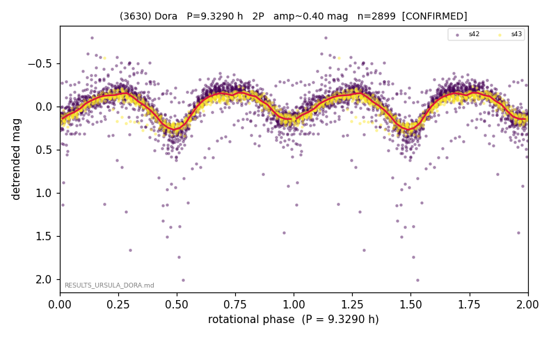

# (3630)

**Adopted:** 9.329 h, 2P, CONFIRMED

<!-- AUTO:START (regenerated from pipeline outputs; do not hand-edit this block) -->
## Evidence (auto)

Detected in 2 sector(s):

| sector | N | baseline (h) | P_phot (h) | power | FAP | cycles | flags |
|--|--|--|--|--|--|--|--|
| s42 | 1967 | 589.4 | 4.6639 | 0.582 | 0.0e+00 | 126.4 | star-cleaned:9,2P-ambiguous |
| s43 | 932 | 183.8 | 4.6669 | 0.7955 | 7.9e-316 | 19.7 | star-cleaned:17 |

- Refined shape: **1P** (folded amp_fourier 0.378); flags: sector-dropped:s42(range>3mag);near-threshold:0.38
- DIA (de-comb): survived(dPW=+2%,R2=0.16,s43@4.665h,3sec)
- Gates: FAP<1e-3 and power>=0.10 per detecting sector; >=2 sectors agree (harmonic-aware); folded-amplitude rule -> 2P.

<!-- AUTO:END -->
