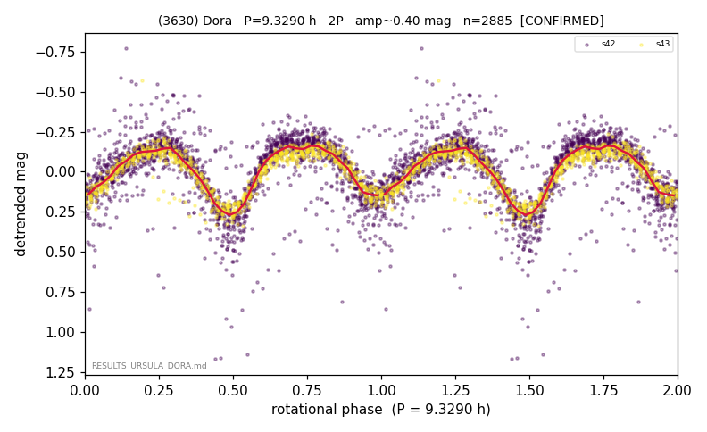

# (3630)

**Adopted:** 9.33 h, 2P, CONFIRMED

<!-- AUTO:START (regenerated from pipeline outputs; do not hand-edit this block) -->
## Evidence (auto)

Detected in 2 sector(s):

| sector | N | baseline (h) | P_phot (h) | power | FAP | cycles | flags |
|--|--|--|--|--|--|--|--|
| s42 | 1967 | 589.4 | 4.6639 | 0.582 | 0.0e+00 | 126.4 | star-cleaned:9,2P-ambiguous |
| s43 | 932 | 183.8 | 4.6669 | 0.7955 | 7.9e-316 | 19.7 | star-cleaned:17 |

- Pipeline refine said: **2P** (folded amp_fourier 0.427); flags: sick-dips-excised:s42(14);near-threshold:0.43
- DIA (de-comb): survived(dPW=+2%,R2=0.16,s43@4.665h,3sec)
- Coverage: **2 sector(s)**, best sector covers **63.17 cycles** of the adopted period. Measured periodogram peak width 1% of the period, i.e. about **+/- 0.01 h** (1 sigma); the decimal places in the adopted value are not a precision claim.
- Factor of two: **not stated**, which is a defect in this entry.
- Gates: FAP<1e-3 and power>=0.10 per detecting sector; >=2 sectors agree (harmonic-aware).
- Adopted shape: **2P** (folded-amplitude rule; pipeline agrees).

### Why this row reads the way it does

- doubling proven: 8.8-sigma phase-locked minima asymmetry; P doubled 2026-07-25 after robust sector rule recovered a bright sector (amp 0.427)

<!-- AUTO:END -->
