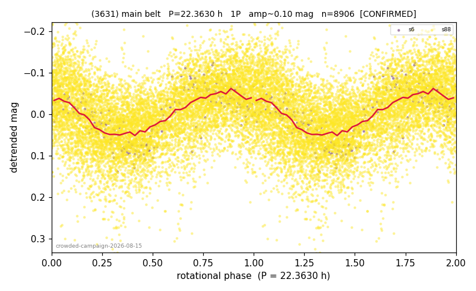

# (3631)

**Adopted:** 22.363 h, 1P, CONFIRMED

<!-- AUTO:START (regenerated from pipeline outputs; do not hand-edit this block) -->
## Evidence (auto)

Detected in 2 sector(s):

| sector | N | baseline (h) | P_phot (h) | power | FAP | cycles | flags |
|--|--|--|--|--|--|--|--|
| s6 | 219 | 153.5 | 22.2164 | 0.6214 | 2.1e-42 | 6.9 | clean |
| s88 | 8741 | 605.4 | 22.5102 | 0.213 | 0.0e+00 | 26.9 | star-cleaned:79,2P-ambiguous |

- Pipeline refine said: **1P** (folded amp_fourier 0.149); flags: dump-alias-suspect:n=15;sick-dips-excised:s88(18)
- DIA (de-comb): survived(dPW=+3%,R2=0.02,s88@22.510h,3sec)
- Coverage: **1 sector(s)**, best sector covers **27.07 cycles** of the adopted period. Measured periodogram peak width 3% of the period, i.e. about **+/- 0.3191 h** (1 sigma); the decimal places in the adopted value are not a precision claim.
- Factor of two: no doubling was applied.
- Gates: FAP<1e-3 and power>=0.10 per detecting sector; >=2 sectors agree (harmonic-aware).
- Adopted shape: **1P** (folded-amplitude rule; pipeline agrees).

### Why this row reads the way it does

- crowded-field campaign, adversarial review 2026-08-15: 2/2 true detections (22.216h pw 0.618, 22.511h pw 0.213), null 0/200; 13.7d/15 alias at 2.0% checked, common-mode negative
- amp 0.11-0.19 -> 1P

<!-- AUTO:END -->
