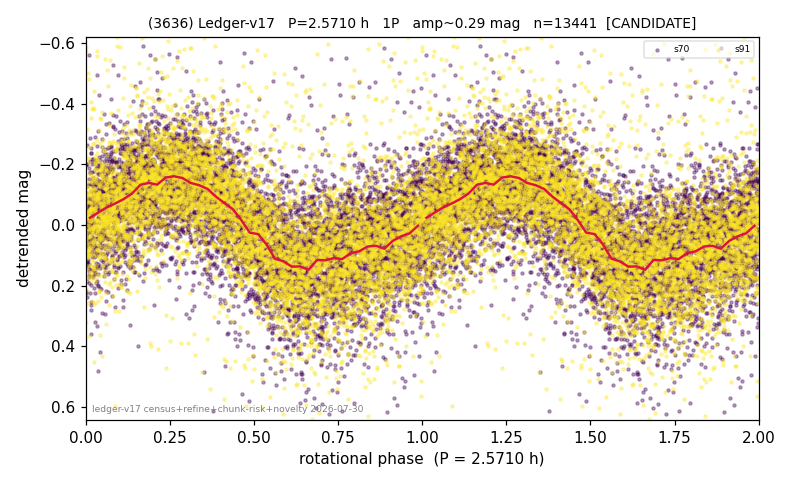

# (3636)

**Adopted:** 2.571 h, 1P, CANDIDATE

<!-- AUTO:START (regenerated from pipeline outputs; do not hand-edit this block) -->
## Evidence (auto)

Detected in 2 sector(s):

| sector | N | baseline (h) | P_phot (h) | power | FAP | cycles | flags |
|--|--|--|--|--|--|--|--|
| s70 | 6969 | 489.1 | 2.5713 | 0.3352 | 0.0e+00 | 190.2 | star-cleaned:6,2P-ambiguous |
| s91 | 6501 | 642.9 | 2.5719 | 0.3544 | 0.0e+00 | 250.0 | star-cleaned:105,2P-ambiguous |

- Pipeline refine said: **1P** (folded amp_fourier 0.302); flags: sick-dips-excised:s70(19),s91(22)
- DIA (de-comb): survived(dPW=+0%,R2=0.02,s91@2.571h,4sec)
- Coverage: **2 sector(s)**, best sector covers **250.08 cycles** of the adopted period. Measured periodogram peak width 0% of the period, i.e. about **+/- 0.004013 h** (1 sigma); the decimal places in the adopted value are not a precision claim.
- Factor of two: no doubling was applied.
- Gates: FAP<1e-3 and power>=0.10 per detecting sector; single strong sector (candidate ceiling).
- Adopted shape: **1P** (folded-amplitude rule; pipeline agrees).

### Why this row reads the way it does

- 2 sector(s) detecting
- cross-sector fold correlation 0.98
- single-peaked at folded amp 0.302 mag
- CHUNK QUARANTINE (AMP_DOMINATED): the stitching steps applied between chunks are LARGER than the object's own folded amplitude, so any fold shape may be an artefact. Needs a direct re-extraction before this period can be claimed
- CHUNK QUARANTINE LIFTED by direct re-extraction 2026-08-05: the sector(s) were re-extracted without chunking and the power at the adopted period is retained or improved (s70 power 0.219->0.286, s91 power 0.297->0.237). The stitching filter was not creating this period.

<!-- AUTO:END -->
