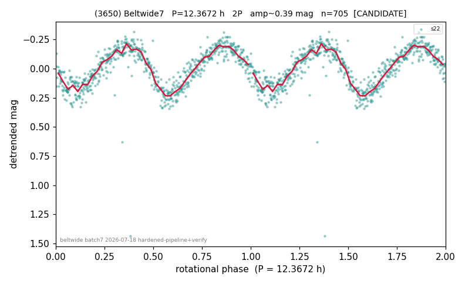

# (3650)

**Adopted:** 12.3672 h, 2P, CANDIDATE

<!-- AUTO:START (regenerated from pipeline outputs; do not hand-edit this block) -->
## Evidence (auto)

Detected in 1 sector(s):

| sector | N | baseline (h) | P_phot (h) | power | FAP | cycles | flags |
|--|--|--|--|--|--|--|--|
| s22 | 705 | 529.5 | 6.1836 | 0.7787 | 7.4e-226 | 85.6 | 2P-ambiguous |

- Refined shape: **2P** (folded amp_fourier 0.402); flags: near-threshold:0.40
- DIA (de-comb): not triggered (clean, fast, non-comb)
- Gates: FAP<1e-3 and power>=0.10 per detecting sector; single strong sector (candidate ceiling); folded-amplitude rule -> 2P.

<!-- AUTO:END -->
