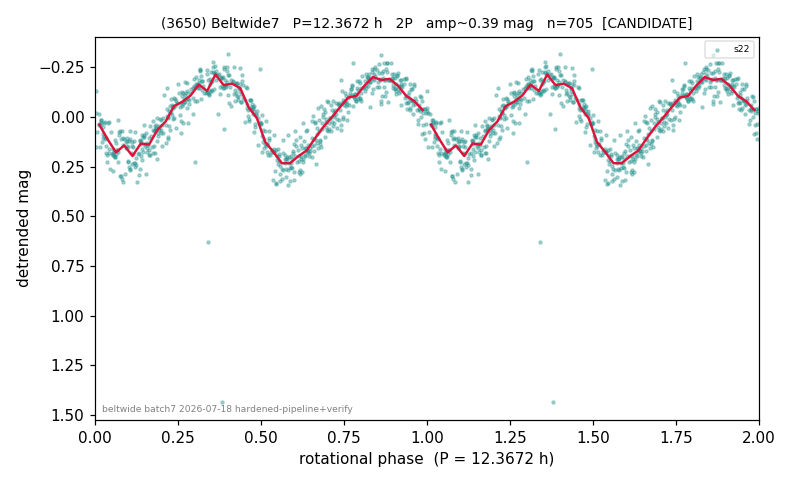

# (3650)

**Adopted:** 12.3672 h, 2P, CANDIDATE

<!-- AUTO:START (regenerated from pipeline outputs; do not hand-edit this block) -->
## Evidence (auto)

Detected in 1 sector(s):

| sector | N | baseline (h) | P_phot (h) | power | FAP | cycles | flags |
|--|--|--|--|--|--|--|--|
| s22 | 705 | 529.5 | 6.1836 | 0.7787 | 7.4e-226 | 85.6 | 2P-ambiguous |

- Pipeline refine said: **2P** (folded amp_fourier 0.402); flags: near-threshold:0.40
- DIA (de-comb): not triggered (the object is clean, fast and non-comb, so the test does not apply)
- Coverage: **1 sector(s)**, best sector covers **42.81 cycles** of the adopted period. Measured periodogram peak width 1% of the period, i.e. about **+/- 0.02482 h** (1 sigma); the decimal places in the adopted value are not a precision claim.
- Factor of two: **adopted on the amplitude convention**: standard practice for an elongated body, but a convention rather than a measurement.
- Gates: FAP<1e-3 and power>=0.10 per detecting sector; single strong sector (candidate ceiling).
- Adopted shape: **2P** (folded-amplitude rule; pipeline agrees).

### Why this row reads the way it does

- Indep LS s22: P=6.1836h pw=0.7787 FAP=7.4e-226, matches precomp (0.78/7.6e-226) exactly. PDM cross-check confirms: best P=6.186h theta=0.339
- 2P by amplitude rule (folded_amp=0.402)

<!-- AUTO:END -->
