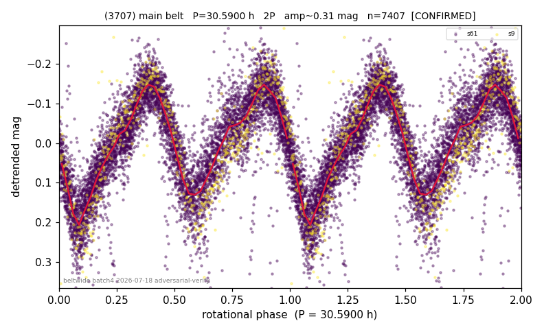

# (3707)

**Adopted:** 30.59 h, 2P, CONFIRMED

<!-- AUTO:START (regenerated from pipeline outputs; do not hand-edit this block) -->
## Evidence (auto)

Detected in 2 sector(s):

| sector | N | baseline (h) | P_phot (h) | power | FAP | cycles | flags |
|--|--|--|--|--|--|--|--|
| s9 | 586 | 377.5 | 15.3018 | 0.7665 | 3.4e-180 | 24.7 | star-cleaned:4,2P-ambiguous |
| s61 | 6852 | 485.7 | 15.288 | 0.6771 | 0.0e+00 | 15.9 | star-cleaned:31 |

- Pipeline refine said: **1P** (folded amp_fourier 0.341); flags: sick-dips-excised:s61(9),s9(2)
- DIA (de-comb): survived(dPW=-2%,R2=0.14,s9@15.295h,5sec)
- Gates: FAP<1e-3 and power>=0.10 per detecting sector; >=2 sectors agree (harmonic-aware).
- **Adopted shape 2P OVERRIDES the pipeline's 1P** (doubling audit 2026-07-25: folded amplitude >= 0.25 mag, so a single-peaked curve is physically implausible; Harris convention -> 2P. The census 3-test doubling logic was measured at only 30% recall against 289 LCDB U>=2 ground-truth periods).

### Why this row reads the way it does

- Independent LS/PDM per sector agree tightly across a 3.8 yr apparition gap: S9 P=15.302h (power 0.767, FAP 3.4e-180) vs S61 P=15.288h (power 0.677, FA; P doubled 2026-07-25 (doubling audit: amp>=0.25 + Harris convention)

<!-- AUTO:END -->
