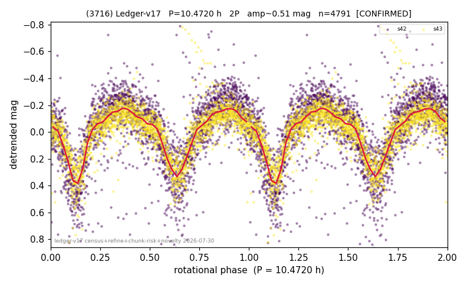

# (3716)

**Adopted:** 10.472 h, 2P, CONFIRMED

<!-- AUTO:START (regenerated from pipeline outputs; do not hand-edit this block) -->
## Evidence (auto)

Detected in 2 sector(s):

| sector | N | baseline (h) | P_phot (h) | power | FAP | cycles | flags |
|--|--|--|--|--|--|--|--|
| s42 | 2615 | 600.0 | 5.2365 | 0.5098 | 0.0e+00 | 114.6 | star-cleaned:32,2P-ambiguous |
| s43 | 2187 | 592.4 | 5.2351 | 0.3405 | 5.5e-193 | 113.2 | 2P-ambiguous |

- Pipeline refine said: **2P** (folded amp_fourier 0.51); flags: sick-dips-excised:s42(8),s43(1)
- DIA (de-comb): survived_v2(ret=0.999[1.00-1.00],s43@5.236h)
- Coverage: **2 sector(s)**, best sector covers **57.3 cycles** of the adopted period. Measured periodogram peak width 1% of the period, i.e. about **+/- 0.01635 h** (1 sigma); the decimal places in the adopted value are not a precision claim.
- Factor of two: **adopted on the amplitude convention**: standard practice for an elongated body, but a convention rather than a measurement.
- Gates: FAP<1e-3 and power>=0.10 per detecting sector; >=2 sectors agree (harmonic-aware).
- Adopted shape: **2P** (folded-amplitude rule; pipeline agrees).

### Why this row reads the way it does

- 2 sector(s) detecting
- cross-sector fold correlation 0.99
- doubling BY CONVENTION: amplitude rule on folded amp 0.510 mag, not individually audited

<!-- AUTO:END -->
