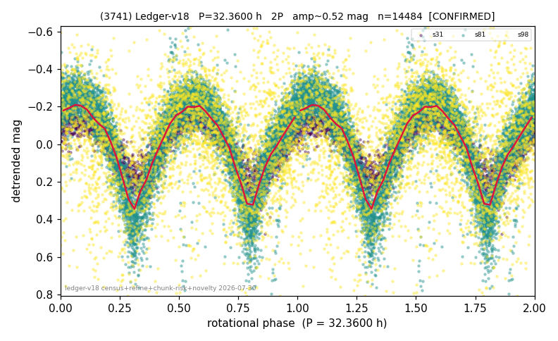

# (3741)

**Adopted:** 32.36 h, 2P, CONFIRMED

<!-- AUTO:START (regenerated from pipeline outputs; do not hand-edit this block) -->
## Evidence (auto)

Detected in 3 sector(s):

| sector | N | baseline (h) | P_phot (h) | power | FAP | cycles | flags |
|--|--|--|--|--|--|--|--|
| s31 | 2670 | 602.5 | 16.1802 | 0.7881 | 0.0e+00 | 37.2 | 2P-ambiguous |
| s81 | 8061 | 619.1 | 16.1791 | 0.7252 | 0.0e+00 | 38.3 | star-cleaned:39,2P-ambiguous |
| s98 | 3790 | 318.2 | 16.3255 | 0.1887 | 1.8e-167 | 19.5 | star-cleaned:131,2P-ambiguous |

- Pipeline refine said: **2P** (folded amp_fourier 0.595); flags: near-comb(amp-cleared):n=10;sick-dips-excised:s81(10),s98(9)
- DIA (de-comb): not triggered (clean, fast, non-comb)
- Gates: FAP<1e-3 and power>=0.10 per detecting sector; >=2 sectors agree (harmonic-aware).
- Adopted shape: **2P** (folded-amplitude rule; pipeline agrees).

### Why this row reads the way it does

- 3 sector(s) detecting
- cross-sector fold correlation 0.96
- doubling BY CONVENTION: amplitude rule on folded amp 0.595 mag, not individually audited

<!-- AUTO:END -->
