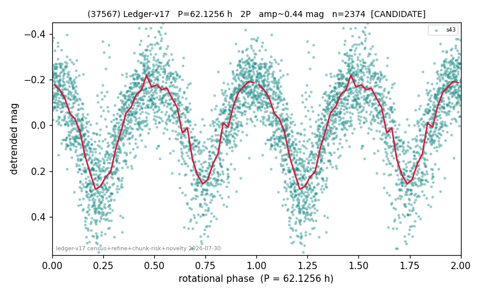

# (37567)

**Adopted:** 62.1256 h, 2P, CANDIDATE

<!-- AUTO:START (regenerated from pipeline outputs; do not hand-edit this block) -->
## Evidence (auto)

Detected in 1 sector(s):

| sector | N | baseline (h) | P_phot (h) | power | FAP | cycles | flags |
|--|--|--|--|--|--|--|--|
| s43 | 2389 | 577.2 | 31.0628 | 0.5942 | 0.0e+00 | 18.6 | star-cleaned:1,2P-ambiguous |

- Pipeline refine said: **2P** (folded amp_fourier 0.464); flags: gap-alias-risk:80h;sick-dips-excised:s43(2)
- DIA (de-comb): survived(dPW=+6%,R2=0.12,s43@31.063h,1sec)
- Coverage: **1 sector(s)**, best sector covers **9.29 cycles** of the adopted period. Measured periodogram peak width 4% of the period, i.e. about **+/- 0.5749 h** (1 sigma); the decimal places in the adopted value are not a precision claim.
- Factor of two: **adopted on the amplitude convention**: standard practice for an elongated body, but a convention rather than a measurement.
- Gates: FAP<1e-3 and power>=0.10 per detecting sector; single strong sector (candidate ceiling).
- Adopted shape: **2P** (folded-amplitude rule; pipeline agrees).

### Why this row reads the way it does

- 1 sector(s) detecting
- doubling BY CONVENTION: amplitude rule on folded amp 0.464 mag, not individually audited

<!-- AUTO:END -->
