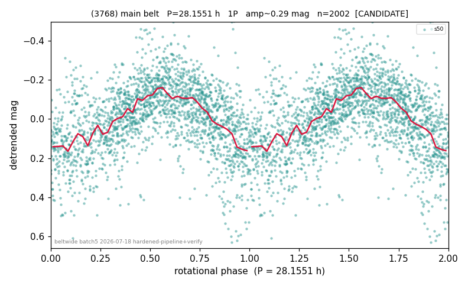

# (3768)

**Adopted:** 28.1551 h, 1P, CANDIDATE

<!-- AUTO:START (regenerated from pipeline outputs; do not hand-edit this block) -->
## Evidence (auto)

Detected in 1 sector(s):

| sector | N | baseline (h) | P_phot (h) | power | FAP | cycles | flags |
|--|--|--|--|--|--|--|--|
| s50 | 2019 | 618.0 | 28.1551 | 0.3233 | 1.2e-166 | 21.9 | star-cleaned:14,2P-ambiguous |

- Pipeline refine said: **1P** (folded amp_fourier 0.297); flags: dump-alias-suspect:n=12;sick-dips-excised:s50(9)
- DIA (de-comb): survived(dPW=-2%,R2=0.24,s50@28.155h,1sec)
- Coverage: **1 sector(s)**, best sector covers **21.95 cycles** of the adopted period. Measured periodogram peak width 4% of the period, i.e. about **+/- 0.4332 h** (1 sigma); the decimal places in the adopted value are not a precision claim.
- Factor of two: no doubling was applied.
- Gates: FAP<1e-3 and power>=0.10 per detecting sector; single strong sector (candidate ceiling).
- Adopted shape: **1P** (folded-amplitude rule; pipeline agrees).

### Why this row reads the way it does

- Independent LS on s50 reproduces P=28.1551h exactly, power=0.323, FAP=1.2e-166, n_cycles=21.9 (matches queue). PDM local min near 28.2h agrees; PDM gl

<!-- AUTO:END -->
