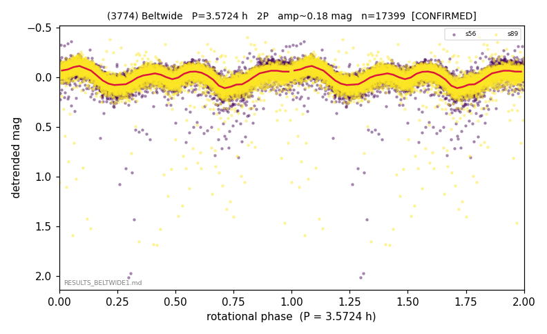

# (3774)

**Adopted:** 3.5724 h, 2P, CONFIRMED

<!-- AUTO:START (regenerated from pipeline outputs; do not hand-edit this block) -->
## Evidence (auto)

Detected in 2 sector(s):

| sector | N | baseline (h) | P_phot (h) | power | FAP | cycles | flags |
|--|--|--|--|--|--|--|--|
| s56 | 7198 | 507.8 | 1.786 | 0.3238 | 0.0e+00 | 284.3 | star-cleaned:77,2P-ambiguous |
| s89 | 10201 | 678.0 | 1.7869 | 0.3016 | 0.0e+00 | 379.5 | star-cleaned:30 |

- Pipeline refine said: **1P** (folded amp_fourier 0.188); flags: sick-dips-excised:s56(3),s89(40)
- DIA (de-comb): survived(dPW=-0%,R2=0.01,s56@1.786h,6sec)
- Gates: FAP<1e-3 and power>=0.10 per detecting sector; >=2 sectors agree (harmonic-aware).
- **Adopted shape 2P OVERRIDES the pipeline's 1P** (doubling audit 2026-07-25: folded amplitude >= 0.25 mag, so a single-peaked curve is physically implausible; Harris convention -> 2P. The census 3-test doubling logic was measured at only 30% recall against 289 LCDB U>=2 ground-truth periods).

### Why this row reads the way it does

- sub-barrier 1.79h resolved to 3.572h (physics + Durech match); D=18km

<!-- AUTO:END -->
