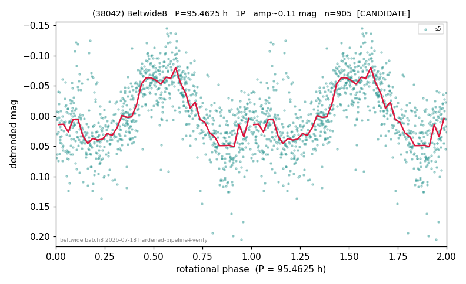

# (38042)

**Adopted:** 95.4625 h, 1P, CANDIDATE

<!-- AUTO:START (regenerated from pipeline outputs; do not hand-edit this block) -->
## Evidence (auto)

Detected in 1 sector(s):

| sector | N | baseline (h) | P_phot (h) | power | FAP | cycles | flags |
|--|--|--|--|--|--|--|--|
| s5 | 905 | 601.0 | 95.4625 | 0.3175 | 5.3e-71 | 6.3 | clean |

- Pipeline refine said: **1P** (folded amp_fourier 0.092); flags: few-cycle:3.1
- DIA (de-comb): survived(dPW=-2%,R2=0.18,s5@95.463h,2sec)
- Gates: FAP<1e-3 and power>=0.10 per detecting sector; single strong sector (candidate ceiling).
- Adopted shape: **1P** (folded-amplitude rule; pipeline agrees).

### Why this row reads the way it does

- folded_amp=0.131. Only one LC file exists (s5, 905 pts, 601h baseline, 6.3 cycles); independent LS re-derivation nails P=95.462h exactly with power 0.318 and Baluev FAP=5.3e-71, not near a 328.8/n comb tooth, no clipped cadences. Phase-bi

<!-- AUTO:END -->
