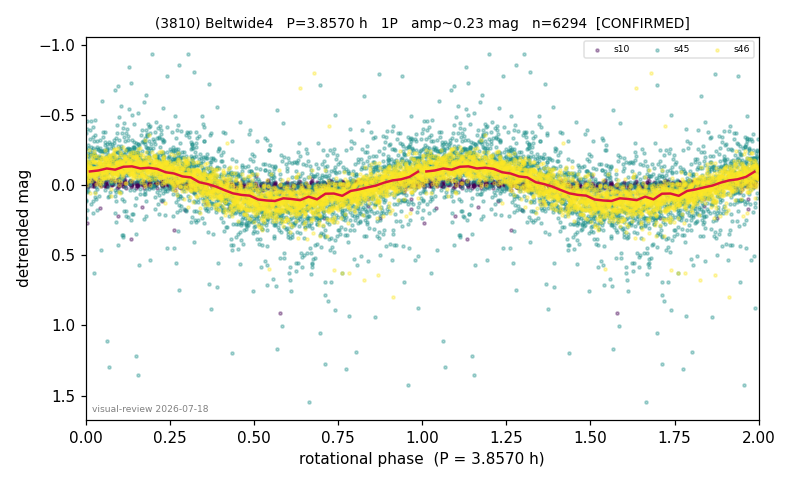

# (3810)

**Adopted:** 3.857 h, 1P, CONFIRMED

<!-- AUTO:START (regenerated from pipeline outputs; do not hand-edit this block) -->
## Evidence (auto)

Detected in 3 sector(s):

| sector | N | baseline (h) | P_phot (h) | power | FAP | cycles | flags |
|--|--|--|--|--|--|--|--|
| s10 | 866 | 588.5 | 294.2534 | 0.1101 | 2.4e-18 | 2.0 | star-cleaned:1,grid-edge,phase-curve-ris |
| s45 | 2570 | 584.7 | 3.856 | 0.2896 | 4.0e-186 | 151.6 | star-cleaned:24,2P-ambiguous |
| s46 | 2858 | 623.0 | 3.8562 | 0.6848 | 0.0e+00 | 161.6 | star-cleaned:4,2P-ambiguous |

- Refined shape: **1P** (folded amp_fourier 0.315); flags: sick-dips-excised:s45(14),s46(3)
- DIA (de-comb): inconclusive(dPW=+35%,R2=0.33,s46@3.856h)
- Gates: FAP<1e-3 and power>=0.10 per detecting sector; >=2 sectors agree (harmonic-aware); folded-amplitude rule -> 1P.

<!-- AUTO:END -->
