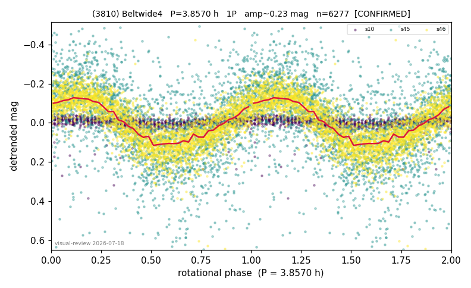

# (3810)

**Adopted:** 7.714 h, 2P, CONFIRMED

<!-- AUTO:START (regenerated from pipeline outputs; do not hand-edit this block) -->
## Evidence (auto)

Detected in 3 sector(s):

| sector | N | baseline (h) | P_phot (h) | power | FAP | cycles | flags |
|--|--|--|--|--|--|--|--|
| s10 | 866 | 588.5 | 294.2534 | 0.1101 | 2.4e-18 | 2.0 | star-cleaned:1,grid-edge,phase-curve-ris |
| s45 | 2570 | 584.7 | 3.856 | 0.2896 | 4.0e-186 | 151.6 | star-cleaned:24,2P-ambiguous |
| s46 | 2858 | 623.0 | 3.8562 | 0.6848 | 0.0e+00 | 161.6 | star-cleaned:4,2P-ambiguous |

- Pipeline refine said: **1P** (folded amp_fourier 0.315); flags: sick-dips-excised:s45(14),s46(3)
- DIA (de-comb): survived_v2(ret=0.999[1.00-1.00],s46@3.856h)
- Coverage: **3 sector(s)**, best sector covers **161.54 cycles** of the adopted period. Measured periodogram peak width 1% of the period, i.e. about **+/- 0.009461 h** (1 sigma); the decimal places in the adopted value are not a precision claim.
- Factor of two: no doubling was applied.
- Gates: FAP<1e-3 and power>=0.10 per detecting sector; >=2 sectors agree (harmonic-aware).
- **Adopted shape 2P OVERRIDES the pipeline's 1P** (doubling audit 2026-07-25: folded amplitude >= 0.25 mag, so a single-peaked curve is physically implausible; Harris convention -> 2P. The census 3-test doubling logic was measured at only 30% recall against 289 LCDB U>=2 ground-truth periods).

### Why this row reads the way it does

- S10 flat: non-detecting (FAP 0.15) at anomalously BRIGHT median (14.66 vs 16.2-16.8), scatter 0.017 vs amp 0.34: blend-dominated extraction or near-pole-on aspect, excluded from published fold; s45/s46 carry 3.857h/1P (folded amp<0.40). Minor field-star pts masked. CONFIRMED holds; doubling REVERTED 2026-07-25: amp came from a much fainter sector; bright-sector amp is 0.08/0.02 mag -> not elongated -> 1P
- DOUBLING CORRECTED 2026-08-30: adopted period doubled from 3.857 h. The previous value came from the folded-amplitude rule, which was found biased low (9 of 9 disagreements with MPB 2024-2026 in the same direction). Odd-harmonic test at the long period gives z1=6.59 with margin 5.05 over non-harmonic multiples 1.7x/2.3x (reference group: 0 of 38 above margin 2).

<!-- AUTO:END -->

## Sector s10 exclusion (2026-07-19)
s10 is non-detecting at the adopted 3.857 h (power 0.025, FAP 0.15) despite excellent
photometry (scatter 0.017 mag), at an anomalously bright median (14.66 vs 16.2-16.8
in s45/s46). A folded amplitude of 0.34 mag cannot hide under 0.017 mag scatter, so
the signal is genuinely absent there: either the extraction was dominated by a blended
field star (which would also explain the 2 mag brightness anomaly) or the aspect was
near pole-on. s10 is excluded from the published fold; the confirmed period rests on
s45 (FAP 8e-137) and s46 (FAP ~0), which agree independently.
