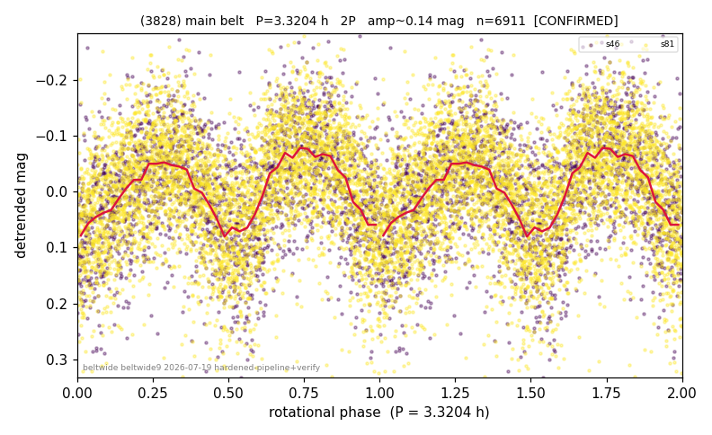

# (3828)

**Adopted:** 3.3204 h, 2P, CONFIRMED

<!-- AUTO:START (regenerated from pipeline outputs; do not hand-edit this block) -->
## Evidence (auto)

Detected in 2 sector(s):

| sector | N | baseline (h) | P_phot (h) | power | FAP | cycles | flags |
|--|--|--|--|--|--|--|--|
| s46 | 2229 | 479.9 | 1.6609 | 0.2117 | 1.2e-110 | 288.9 | star-cleaned:14,2P-ambiguous |
| s81 | 4690 | 302.6 | 1.6598 | 0.2186 | 2.8e-246 | 182.3 | 2P-ambiguous |

- Refined shape: **1P** (folded amp_fourier 0.154); flags: clean
- DIA (de-comb): not triggered (clean, fast, non-comb)
- Gates: FAP<1e-3 and power>=0.10 per detecting sector; >=2 sectors agree (harmonic-aware); folded-amplitude rule -> 2P.

<!-- AUTO:END -->
