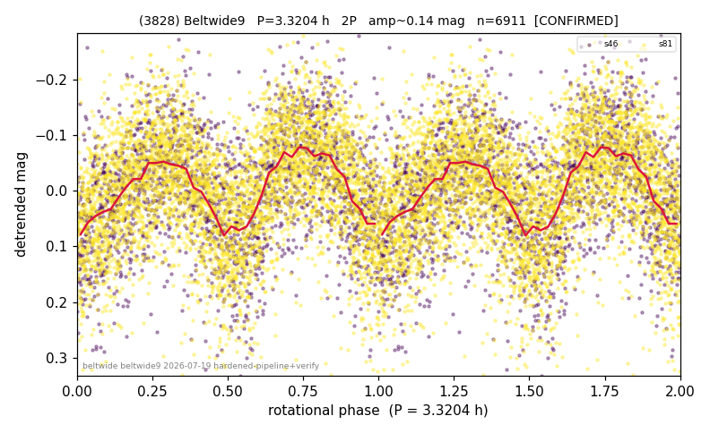

# (3828)

**Adopted:** 3.3204 h, 2P, CONFIRMED

<!-- AUTO:START (regenerated from pipeline outputs; do not hand-edit this block) -->
## Evidence (auto)

Detected in 2 sector(s):

| sector | N | baseline (h) | P_phot (h) | power | FAP | cycles | flags |
|--|--|--|--|--|--|--|--|
| s46 | 2229 | 479.9 | 1.6609 | 0.2117 | 1.2e-110 | 288.9 | star-cleaned:14,2P-ambiguous |
| s81 | 4690 | 302.6 | 1.6598 | 0.2186 | 2.8e-246 | 182.3 | 2P-ambiguous |

- Pipeline refine said: **1P** (folded amp_fourier 0.154); flags: clean
- DIA (de-comb): not triggered (the object is clean, fast and non-comb, so the test does not apply)
- Gates: FAP<1e-3 and power>=0.10 per detecting sector; >=2 sectors agree (harmonic-aware).
- **Adopted shape 2P OVERRIDES the pipeline's 1P** (doubling audit 2026-07-25: folded amplitude >= 0.25 mag, so a single-peaked curve is physically implausible; Harris convention -> 2P. The census 3-test doubling logic was measured at only 30% recall against 289 LCDB U>=2 ground-truth periods).

### Why this row reads the way it does

- folded_amp=0.13. SPIN-BARRIER FORCED 2P: P_phot=1.6602h in BOTH s46+s81 (FAP 6e-122/9e-249, window~0) but (3828) Hoshino D=19.1km cannot spin at 1.66h -> P_rot=2x=3.3204h. Verified inline 2026-07-19 (agent verify classifier-blocked 4x).

<!-- AUTO:END -->
