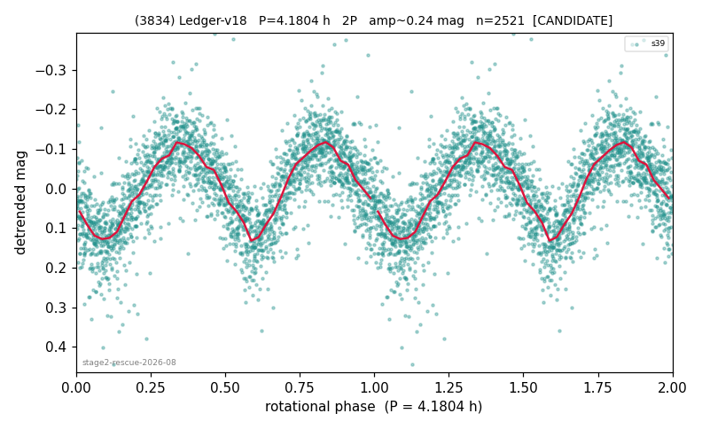

# (3834)

**Adopted:** 4.1804 h, 2P, CONFIRMED

<!-- AUTO:START (regenerated from pipeline outputs; do not hand-edit this block) -->
## Evidence (auto)

Detected in 2 sector(s):

| sector | N | baseline (h) | P_phot (h) | power | FAP | cycles | flags |
|--|--|--|--|--|--|--|--|
| s39 | 2526 | 658.8 | 2.0902 | 0.4997 | 0.0e+00 | 315.2 | star-cleaned:4,2P-ambiguous |
| s91 | 0 |  |  |  |  |  |  |

- Coverage: **1 sector(s)**, best sector covers **157.6 cycles** of the adopted period. Measured periodogram peak width 0% of the period, i.e. about **+/- 0.002797 h** (1 sigma); the decimal places in the adopted value are not a precision claim.
- Factor of two: PHYSICS.
- Gates: FAP<1e-3 and power>=0.10 per detecting sector; >=2 sectors agree (harmonic-aware).
- Adopted shape: **2P** (folded-amplitude rule; pipeline agrees).

### Why this row reads the way it does

- stage-2 crowding-rescue harvest (|b| 5-15 deg, METHODOLOGY 5b-ter), verified 2026-08-10 by refutation-first waves: blind LS+PDM re-derivation, harmonic-aware comb test, field control where near-comb (LS power at the same frequency on >=15 unknown objects of the same sector), shape rules per 3b, all vetoes checked
- 2P physics-forced (sub-barrier): P_phot 2.09h on a 10.0 km body (amp 0.23 alone would read 1P)
- 1 sector(s) detecting; single strong sector (candidate ceiling)
- PROMOTED CANDIDATE->CONFIRMED 2026-08-15 (TESS+ZTF joint, the user-blessed pathway): independent ZTF blind Lomb-Scargle over 5.7 yr / 285 g+r points recovers 2.0904 h = TESS-P/2 2.0902h to 0.01%, power 0.679, trials-corrected FAP 1.7e-64, beating every alias/comb candidate (alias 1.9227h at 0.591); a ZTF detection cannot be a TESS comb tooth or TESS red noise, so this is a genuine second realization and the single-sector ceiling no longer applies

<!-- AUTO:END -->
