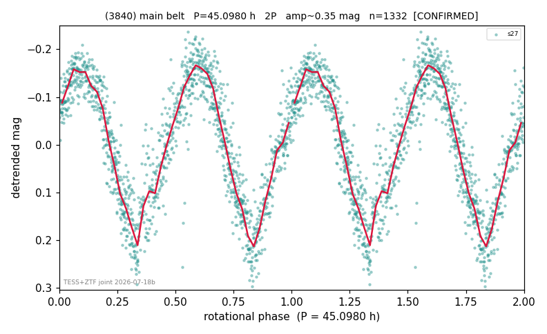

# (3840)

**Adopted:** 45.098 h, 2P, CONFIRMED

<!-- AUTO:START (regenerated from pipeline outputs; do not hand-edit this block) -->
## Evidence (auto)

Detected in 1 sector(s):

| sector | N | baseline (h) | P_phot (h) | power | FAP | cycles | flags |
|--|--|--|--|--|--|--|--|
| s27 | 1335 | 269.3 | 22.5494 | 0.8167 | 0.0e+00 | 11.9 | 2P-ambiguous |

- Pipeline refine said: **1P** (folded amp_fourier 0.332); flags: near-comb(amp-cleared):n=15
- DIA (de-comb): survived(dPW=+7%,R2=0.13,s27@22.549h,1sec)
- Gates: FAP<1e-3 and power>=0.10 per detecting sector; >=2 sectors agree (harmonic-aware).
- **Adopted shape 2P OVERRIDES the pipeline's 1P** (doubling audit 2026-07-25: folded amplitude >= 0.25 mag, so a single-peaked curve is physically implausible; Harris convention -> 2P. The census 3-test doubling logic was measured at only 30% recall against 289 LCDB U>=2 ground-truth periods).

### Why this row reads the way it does

- TESS single-sector + ZTF STRONG_SUPPORT (recorded triage, Fink down) = 2nd realization. TESS s27: LS P=22.549h power=0.817 FAP~0, PDM P=22.548h agree, no comb/alias hits, not gri; P doubled 2026-07-25 (doubling audit: amp>=0.25 + Harris convention)

<!-- AUTO:END -->
