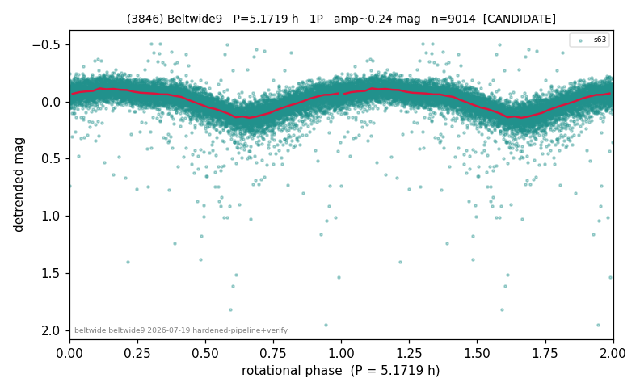

# (3846)

**Adopted:** 5.1719 h, 1P, CANDIDATE

<!-- AUTO:START (regenerated from pipeline outputs; do not hand-edit this block) -->
## Evidence (auto)

Detected in 1 sector(s):

| sector | N | baseline (h) | P_phot (h) | power | FAP | cycles | flags |
|--|--|--|--|--|--|--|--|
| s63 | 9014 | 623.2 | 5.1719 | 0.5507 | 0.0e+00 | 120.5 | star-cleaned:89,2P-ambiguous |

- Refined shape: **1P** (folded amp_fourier 0.259); flags: sick-dips-excised:s63(35)
- DIA (de-comb): survived(dPW=-8%,R2=0.13,s63@5.172h,2sec)
- Gates: FAP<1e-3 and power>=0.10 per detecting sector; single strong sector (candidate ceiling); folded-amplitude rule -> 1P.

<!-- AUTO:END -->
