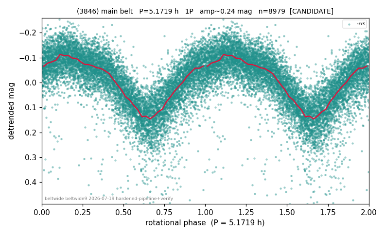

# (3846)

**Adopted:** 10.3438 h, 2P, CONFIRMED

<!-- AUTO:START (regenerated from pipeline outputs; do not hand-edit this block) -->
## Evidence (auto)

Detected in 3 sector(s):

| sector | N | baseline (h) | P_phot (h) | power | FAP | cycles | flags |
|--|--|--|--|--|--|--|--|
| s43 | 2446 | 566.2 | 5.1727 | 0.32 | 3.9e-200 | 109.5 | star-cleaned:25,2P-ambiguous |
| s44 | 2598 | 570.9 | 5.1747 | 0.4641 | 0.0e+00 | 110.3 | 2P-ambiguous |
| s63 | 9014 | 623.2 | 5.1719 | 0.5507 | 0.0e+00 | 120.5 | star-cleaned:89,2P-ambiguous |

- Pipeline refine said: **1P** (folded amp_fourier 0.259); flags: sick-dips-excised:s63(35)
- DIA (de-comb): survived_v2(ret=1.006[1.00-1.01],s63@5.172h)
- Coverage: **3 sector(s)**, best sector covers **120.49 cycles** of the adopted period. Measured periodogram peak width 1% of the period, i.e. about **+/- 0.0173 h** (1 sigma); the decimal places in the adopted value are not a precision claim.
- Factor of two: no doubling was applied.
- Gates: FAP<1e-3 and power>=0.10 per detecting sector; >=2 sectors agree (harmonic-aware).
- **Adopted shape 2P OVERRIDES the pipeline's 1P** (doubling audit 2026-07-25: folded amplitude >= 0.25 mag, so a single-peaked curve is physically implausible; Harris convention -> 2P. The census 3-test doubling logic was measured at only 30% recall against 289 LCDB U>=2 ground-truth periods).

### Why this row reads the way it does

- folded_amp=0.258. Single-sector s63 (cap); power 0.55 FAP~0, 120 cycles, clean isolated peak; amp<0.40 -> 1P.
- s43+s44 crowding-rescued (|b| 5-15 campaign 2026-08-13): own peaks 5.173/5.174h, power 0.32/0.46, null-calibrated gate 0/200 false pass; magnitude offsets toward FAINT (geometry, not blending)
- PROMOTED CANDIDATE->CONFIRMED: two new independent detecting sectors pass the per-sector gates (adversarial pass 2026-08-15)
- DOUBLING CORRECTED 2026-08-30: adopted period doubled from 5.1719 h. The previous value came from the folded-amplitude rule, which was found biased low (9 of 9 disagreements with MPB 2024-2026 in the same direction). Odd-harmonic test at the long period gives z1=6.85 with margin 3.16 over non-harmonic multiples 1.7x/2.3x (reference group: 0 of 38 above margin 2).

<!-- AUTO:END -->
