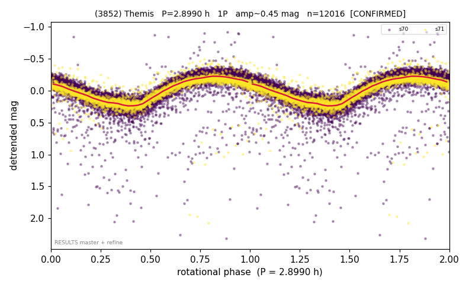

# (3852)

**Adopted:** 5.798 h, 2P, CONFIRMED

<!-- AUTO:START (regenerated from pipeline outputs; do not hand-edit this block) -->
## Evidence (auto)

Detected in 2 sector(s):

| sector | N | baseline (h) | P_phot (h) | power | FAP | cycles | flags |
|--|--|--|--|--|--|--|--|
| s70 | 8734 | 593.2 | 2.8992 | 0.7349 | 0.0e+00 | 204.6 | star-cleaned:35,2P-ambiguous |
| s71 | 3282 | 193.2 | 2.899 | 0.843 | 0.0e+00 | 66.7 | 2P-ambiguous |

- Pipeline refine said: **2P** (folded amp_fourier 0.505); flags: sick-dips-excised:s70(44),s71(8)
- DIA (de-comb): survived(dPW=-6%,R2=0.17,s71@2.899h,3sec)
- Coverage: **2 sector(s)**, best sector covers **102.31 cycles** of the adopted period. Measured periodogram peak width 0% of the period, i.e. about **+/- 0.01 h** (1 sigma); the decimal places in the adopted value are not a precision claim.
- Factor of two: **adopted on the amplitude convention**: standard practice for an elongated body, but a convention rather than a measurement.
- Gates: FAP<1e-3 and power>=0.10 per detecting sector; >=2 sectors agree (harmonic-aware).
- Adopted shape: **2P** (folded-amplitude rule; pipeline agrees).

### Why this row reads the way it does

- DOUBLED 1P->2P 2.899->5.798h (high-amp 1P audit 2026-07-18: folded amp 0.45 = elongated/double-peaked; house rule amp>0.40->2P).

<!-- AUTO:END -->
