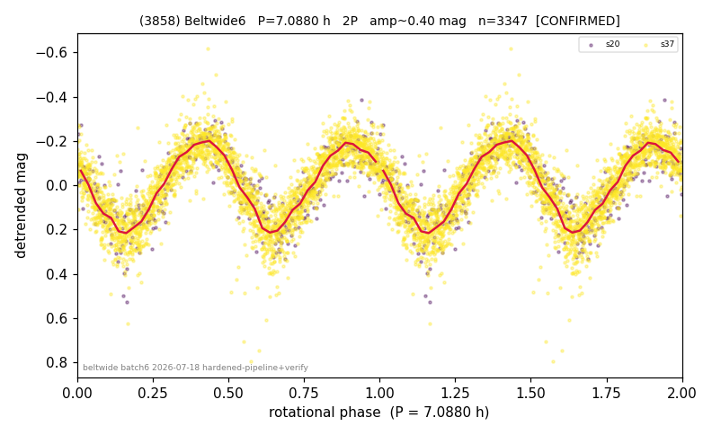

# (3858)

**Adopted:** 7.088 h, 2P, CONFIRMED

<!-- AUTO:START (regenerated from pipeline outputs; do not hand-edit this block) -->
## Evidence (auto)

Detected in 2 sector(s):

| sector | N | baseline (h) | P_phot (h) | power | FAP | cycles | flags |
|--|--|--|--|--|--|--|--|
| s20 | 413 | 254.5 | 3.5444 | 0.744 | 1.1e-117 | 71.8 | 2P-ambiguous |
| s37 | 2934 | 602.5 | 3.5433 | 0.7789 | 0.0e+00 | 170.0 | star-cleaned:5,2P-ambiguous |

- Pipeline refine said: **2P** (folded amp_fourier 0.412); flags: near-threshold:0.41
- DIA (de-comb): not triggered (the object is clean, fast and non-comb, so the test does not apply)
- Coverage: **2 sector(s)**, best sector covers **85.0 cycles** of the adopted period. Measured periodogram peak width 1% of the period, i.e. about **+/- 0.008693 h** (1 sigma); the decimal places in the adopted value are not a precision claim.
- Factor of two: **adopted on the amplitude convention**: standard practice for an elongated body, but a convention rather than a measurement.
- Gates: FAP<1e-3 and power>=0.10 per detecting sector; >=2 sectors agree (harmonic-aware).
- Adopted shape: **2P** (folded-amplitude rule; pipeline agrees).

### Why this row reads the way it does

- REVIEW-FLAG: folded_amp=0.405. Both sectors independently nail the same photometric period to 4 sig figs (s20: P=3.5445h, pow=0.745, FAP=8e-119; s37: P=3.5441h, pow=0.786, FAP~0) with no comb-tooth match (328.8/n misses both 3.544h and 7.088

<!-- AUTO:END -->
