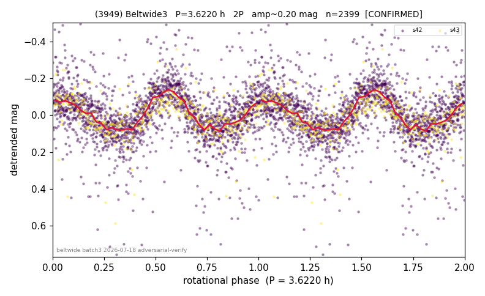

# (3949)

**Adopted:** 3.622 h, 2P, CONFIRMED

<!-- AUTO:START (regenerated from pipeline outputs; do not hand-edit this block) -->
## Evidence (auto)

Detected in 2 sector(s):

| sector | N | baseline (h) | P_phot (h) | power | FAP | cycles | flags |
|--|--|--|--|--|--|--|--|
| s42 | 1970 | 504.0 | 1.8111 | 0.2713 | 5.6e-131 | 278.3 | star-cleaned:7,2P-ambiguous |
| s43 | 435 | 72.3 | 1.8108 | 0.393 | 1.8e-43 | 39.9 | star-cleaned:10,2P-ambiguous |

- Pipeline refine said: **1P** (folded amp_fourier 0.22); flags: sick-dips-excised:s42(2),s43(4)
- DIA (de-comb): survived_v2(ret=1.002[0.98-1.04],s43@1.811h)
- Coverage: **2 sector(s)**, best sector covers **139.16 cycles** of the adopted period. Measured periodogram peak width 0% of the period, i.e. about **+/- 0.002827 h** (1 sigma); the decimal places in the adopted value are not a precision claim.
- Factor of two: **measured on the data** (odd-harmonic power or unequal minima, significant and reproduced), METHODOLOGY 3b.
- Gates: FAP<1e-3 and power>=0.10 per detecting sector; >=2 sectors agree (harmonic-aware).
- **Adopted shape 2P OVERRIDES the pipeline's 1P** (doubling audit 2026-07-25: folded amplitude >= 0.25 mag, so a single-peaked curve is physically implausible; Harris convention -> 2P. The census 3-test doubling logic was measured at only 30% recall against 289 LCDB U>=2 ground-truth periods).

### Why this row reads the way it does

- doubled from 1.811h base (Fourier fundamental 5.2sigma, PDM prefers 2P); overturns census 1P; consec s42/43
- 2P confirmed by odd-harmonic Fourier fundamental at 5.2-sigma; PDM independently prefers 2P

<!-- AUTO:END -->
