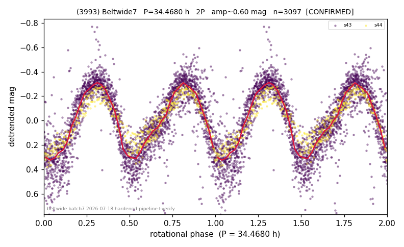

# (3993)

**Adopted:** 34.468 h, 2P, CONFIRMED

<!-- AUTO:START (regenerated from pipeline outputs; do not hand-edit this block) -->
## Evidence (auto)

Detected in 2 sector(s):

| sector | N | baseline (h) | P_phot (h) | power | FAP | cycles | flags |
|--|--|--|--|--|--|--|--|
| s43 | 2647 | 592.4 | 17.1948 | 0.6376 | 0.0e+00 | 34.5 | star-cleaned:109,2P-ambiguous |
| s44 | 460 | 79.3 | 17.2726 | 0.8807 | 5.2e-207 | 4.6 | 2P-ambiguous |

- Pipeline refine said: **2P** (folded amp_fourier 0.66); flags: sick-dips-excised:s43(10)
- DIA (de-comb): survived(dPW=+4%,R2=0.06,s44@17.234h,2sec)
- Gates: FAP<1e-3 and power>=0.10 per detecting sector; >=2 sectors agree (harmonic-aware).
- Adopted shape: **2P** (folded-amplitude rule; pipeline agrees).

### Why this row reads the way it does

- s43 P=17.195h(pw.638,FAP~0,34.5cyc,sharp,offset18% from comb-n19); s44 P=17.273h(pw.881,FAP5e-207,4.6cyc,broad,peak=comb-n19 power, comb-deg

<!-- AUTO:END -->
