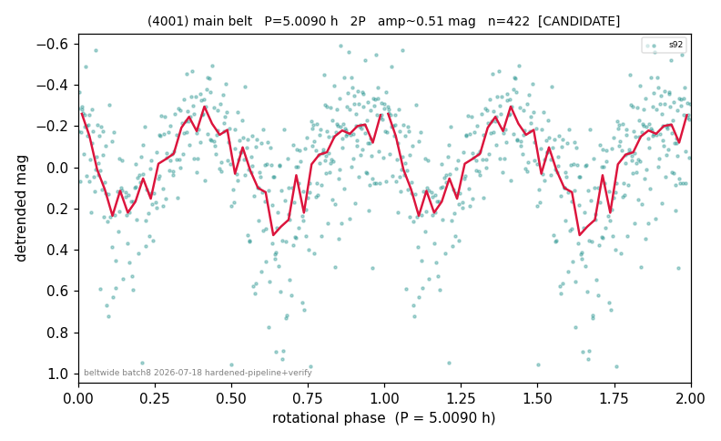

# (4001)

**Adopted:** 5.009 h, 2P, CANDIDATE

<!-- AUTO:START (regenerated from pipeline outputs; do not hand-edit this block) -->
## Evidence (auto)

Detected in 1 sector(s):

| sector | N | baseline (h) | P_phot (h) | power | FAP | cycles | flags |
|--|--|--|--|--|--|--|--|
| s92 | 423 | 27.7 | 2.5045 | 0.3658 | 3.3e-38 | 11.1 | 2P-ambiguous |

- Refined shape: **2P** (folded amp_fourier 0.524); flags: sick-dips-excised:s92(1)
- DIA (de-comb): survived(dPW=+12%,R2=0.16,s92@2.505h,1sec)
- Gates: FAP<1e-3 and power>=0.10 per detecting sector; single strong sector (candidate ceiling); folded-amplitude rule -> 2P.

<!-- AUTO:END -->
