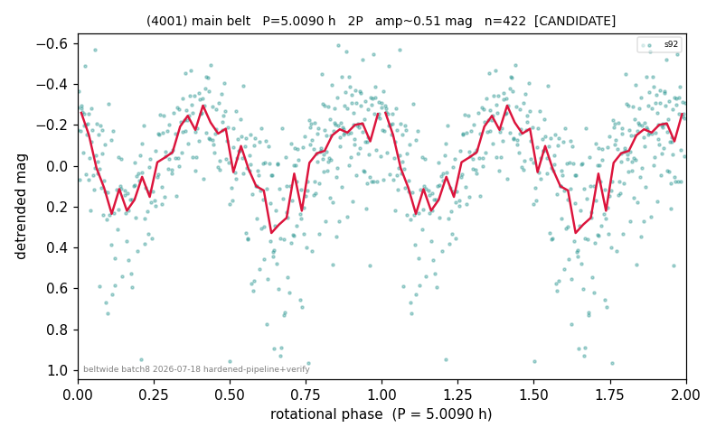

# (4001)

**Adopted:** 5.009 h, 2P, CANDIDATE

<!-- AUTO:START (regenerated from pipeline outputs; do not hand-edit this block) -->
## Evidence (auto)

Detected in 1 sector(s):

| sector | N | baseline (h) | P_phot (h) | power | FAP | cycles | flags |
|--|--|--|--|--|--|--|--|
| s92 | 423 | 27.7 | 2.5045 | 0.3658 | 3.3e-38 | 11.1 | 2P-ambiguous |

- Pipeline refine said: **2P** (folded amp_fourier 0.524); flags: sick-dips-excised:s92(1)
- DIA (de-comb): survived_v2(ret=0.994[0.97-1.00],s92@2.505h)
- Coverage: **1 sector(s)**, best sector covers **5.53 cycles** of the adopted period. Measured periodogram peak width 8% of the period, i.e. about **+/- 0.08377 h** (1 sigma); the decimal places in the adopted value are not a precision claim.
- Factor of two: **adopted on the amplitude convention**: standard practice for an elongated body, but a convention rather than a measurement.
- Gates: FAP<1e-3 and power>=0.10 per detecting sector; single strong sector (candidate ceiling).
- Adopted shape: **2P** (folded-amplitude rule; pipeline agrees).

### Why this row reads the way it does

- folded_amp=0.54. Independent LS scan on s92 (423 pts, 27.7h baseline) reproduces the pipeline exactly: fundamental P=2.5045h, power=0.366, Baluev FAP=3.3e-38 (well below 1e-6), doubling to P_rot=5.009h (11.1/5.5 cycles); folded phase-bin

<!-- AUTO:END -->
