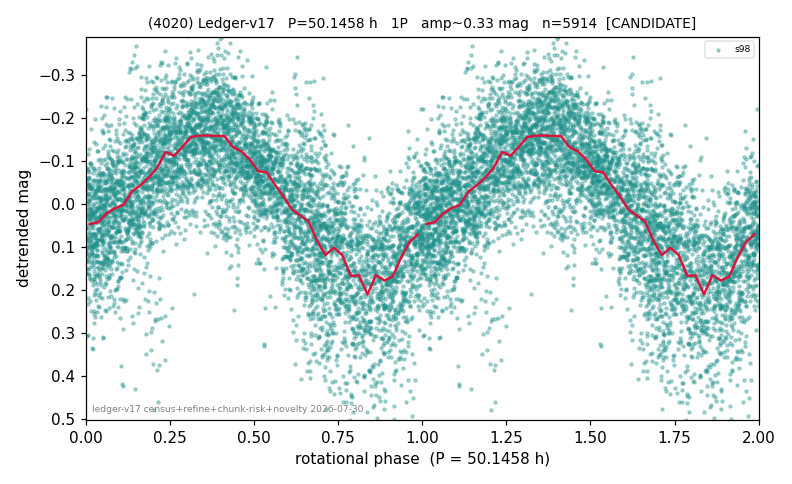

# (4020)

**Adopted:** 50.1458 h, 1P, CANDIDATE

<!-- AUTO:START (regenerated from pipeline outputs; do not hand-edit this block) -->
## Evidence (auto)

Detected in 1 sector(s):

| sector | N | baseline (h) | P_phot (h) | power | FAP | cycles | flags |
|--|--|--|--|--|--|--|--|
| s98 | 5981 | 406.9 | 50.1458 | 0.4846 | 0.0e+00 | 8.1 | star-cleaned:50,2P-ambiguous |

- Pipeline refine said: **1P** (folded amp_fourier 0.365); flags: sick-dips-excised:s98(13);near-threshold:0.37
- DIA (de-comb): survived(dPW=+10%,R2=0.09,s98@50.146h,1sec)
- Gates: FAP<1e-3 and power>=0.10 per detecting sector; single strong sector (candidate ceiling).
- Adopted shape: **1P** (folded-amplitude rule; pipeline agrees).

### Why this row reads the way it does

- 1 sector(s) detecting
- single-peaked at folded amp 0.365 mag

<!-- AUTO:END -->
