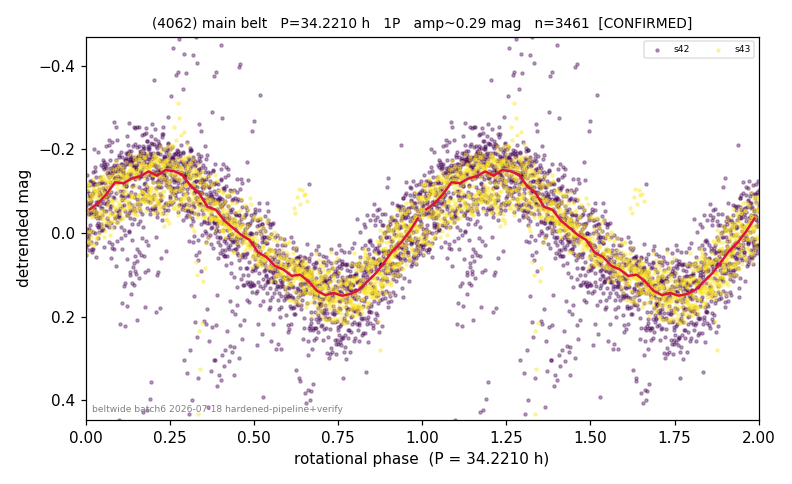

# (4062)

**Adopted:** 34.221 h, 1P, CONFIRMED

<!-- AUTO:START (regenerated from pipeline outputs; do not hand-edit this block) -->
## Evidence (auto)

Detected in 2 sector(s):

| sector | N | baseline (h) | P_phot (h) | power | FAP | cycles | flags |
|--|--|--|--|--|--|--|--|
| s42 | 2096 | 583.0 | 34.221 | 0.5349 | 0.0e+00 | 17.0 | star-cleaned:7,2P-ambiguous |
| s43 | 1397 | 397.8 | 34.2208 | 0.7196 | 0.0e+00 | 11.6 | star-cleaned:2,2P-ambiguous |

- Refined shape: **1P** (folded amp_fourier 0.285); flags: sector-dropped:s42(range>3mag)
- DIA (de-comb): survived(dPW=+4%,R2=0.24,s43@34.221h,2sec)
- Gates: FAP<1e-3 and power>=0.10 per detecting sector; >=2 sectors agree (harmonic-aware); folded-amplitude rule -> 1P.

<!-- AUTO:END -->
