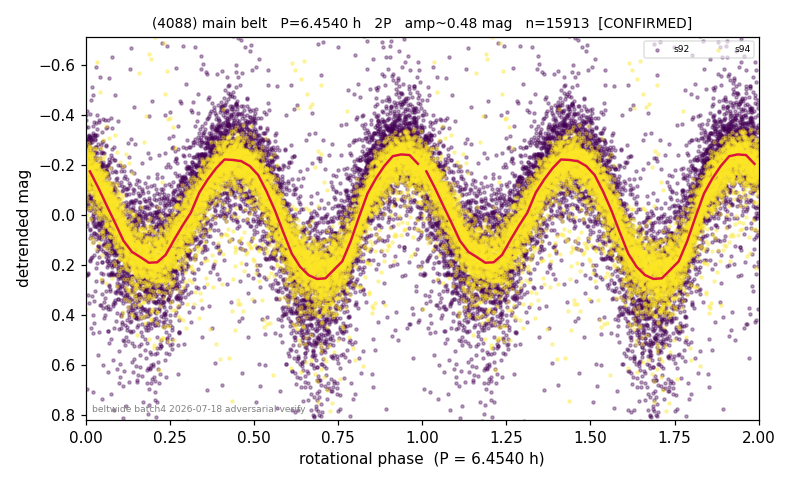

# (4088)

**Adopted:** 6.454 h, 2P, CONFIRMED

<!-- AUTO:START (regenerated from pipeline outputs; do not hand-edit this block) -->
## Evidence (auto)

Detected in 2 sector(s):

| sector | N | baseline (h) | P_phot (h) | power | FAP | cycles | flags |
|--|--|--|--|--|--|--|--|
| s92 | 8249 | 632.8 | 3.2267 | 0.5534 | 0.0e+00 | 196.1 | star-cleaned:22,2P-ambiguous |
| s94 | 7764 | 602.1 | 3.2275 | 0.7587 | 0.0e+00 | 93.3 | star-cleaned:51 |

- Gates: FAP<1e-3 and power>=0.10 per detecting sector; >=2 sectors agree (harmonic-aware); folded-amplitude rule -> 2P.

<!-- AUTO:END -->
