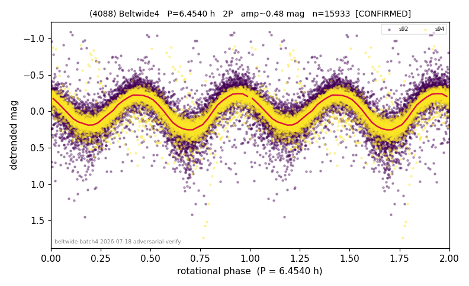

# (4088)

**Adopted:** 6.454 h, 2P, CONFIRMED

<!-- AUTO:START (regenerated from pipeline outputs; do not hand-edit this block) -->
## Evidence (auto)

Detected in 2 sector(s):

| sector | N | baseline (h) | P_phot (h) | power | FAP | cycles | flags |
|--|--|--|--|--|--|--|--|
| s92 | 8249 | 632.8 | 3.2267 | 0.5534 | 0.0e+00 | 196.1 | star-cleaned:22,2P-ambiguous |
| s94 | 7764 | 602.1 | 3.2275 | 0.7587 | 0.0e+00 | 93.3 | star-cleaned:51 |

- Pipeline refine said: **2P** (folded amp_fourier 0.473); flags: amp-from-clean-sectors(ignored s92);sick-dips-excised:s92(64),s94(16)
- DIA (de-comb): survived_v2(ret=1.000[1.00-1.00],s94@3.227h)
- Coverage: **2 sector(s)**, best sector covers **98.04 cycles** of the adopted period. Measured periodogram peak width 0% of the period, i.e. about **+/- 0.006476 h** (1 sigma); the decimal places in the adopted value are not a precision claim.
- Factor of two: **adopted on the amplitude convention**: standard practice for an elongated body, but a convention rather than a measurement.
- Gates: FAP<1e-3 and power>=0.10 per detecting sector; >=2 sectors agree (harmonic-aware).
- Adopted shape: **2P** (folded-amplitude rule; pipeline agrees).

### Why this row reads the way it does

- Independent LS and PDM analyses recover the same ~3.227h fundamental in both sectors and combined (S92 LS=3.2272h/PDM=3.2270h; S94 LS=3.2270h/PDM=3.22
- 2P by amplitude rule (folded_amp=0.473)

<!-- AUTO:END -->
