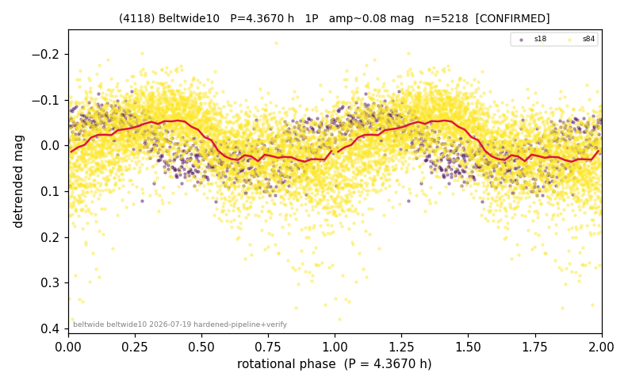

# (4118)

**Adopted:** 4.367 h, 1P, CONFIRMED

<!-- AUTO:START (regenerated from pipeline outputs; do not hand-edit this block) -->
## Evidence (auto)

Detected in 2 sector(s):

| sector | N | baseline (h) | P_phot (h) | power | FAP | cycles | flags |
|--|--|--|--|--|--|--|--|
| s18 | 707 | 569.0 | 4.3677 | 0.5416 | 2.3e-115 | 65.1 | clean |
| s84 | 4511 | 318.2 | 4.3668 | 0.2505 | 1.8e-277 | 36.4 | star-cleaned:1 |

- Refined shape: **1P** (folded amp_fourier 0.136); flags: clean
- DIA (de-comb): not triggered (clean, fast, non-comb)
- Gates: FAP<1e-3 and power>=0.10 per detecting sector; >=2 sectors agree (harmonic-aware); folded-amplitude rule -> 1P.

<!-- AUTO:END -->
