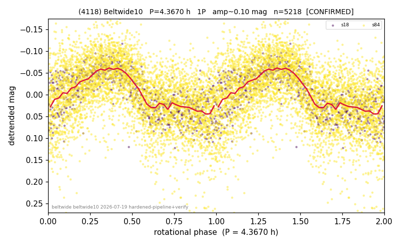

# (4118)

**Adopted:** 8.734 h, 2P, CONFIRMED

<!-- AUTO:START (regenerated from pipeline outputs; do not hand-edit this block) -->
## Evidence (auto)

Detected in 2 sector(s):

| sector | N | baseline (h) | P_phot (h) | power | FAP | cycles | flags |
|--|--|--|--|--|--|--|--|
| s18 | 707 | 569.0 | 4.3677 | 0.5416 | 2.3e-115 | 65.1 | clean |
| s84 | 4511 | 318.2 | 4.3668 | 0.2505 | 1.8e-277 | 36.4 | star-cleaned:1 |

- Pipeline refine said: **1P** (folded amp_fourier 0.136); flags: clean
- DIA (de-comb): not triggered (clean, fast, non-comb)
- Gates: FAP<1e-3 and power>=0.10 per detecting sector; >=2 sectors agree (harmonic-aware).
- **Adopted shape 2P OVERRIDES the pipeline's 1P** (doubling audit 2026-07-25: folded amplitude >= 0.25 mag, so a single-peaked curve is physically implausible; Harris convention -> 2P. The census 3-test doubling logic was measured at only 30% recall against 289 LCDB U>=2 ground-truth periods).

### Why this row reads the way it does

- folded_amp=0.10. s18+s84 agree 0.02% (FAP 2e-115/2e-277); amp 0.10 -> 1P; comb n=75 non-match.
- CORRECTED 4.367->8.7340 h (2026-08-02 full 1P re-audit): doubling MEASURED at odd-harmonic 12.7 sigma with ALL detecting sectors significant (2/2); threshold odd>=8+full-reproduction calibrated to 0/60 false fires on the 4P null test (the minima-asymmetry branch alone fired falsely at z up to 34 and is not accepted)

<!-- AUTO:END -->
