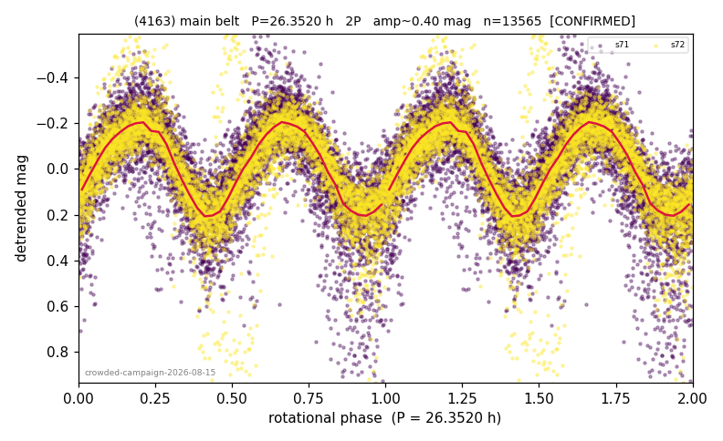

# (4163)

**Adopted:** 26.352 h, 2P, CONFIRMED

<!-- AUTO:START (regenerated from pipeline outputs; do not hand-edit this block) -->
## Evidence (auto)

Detected in 2 sector(s):

| sector | N | baseline (h) | P_phot (h) | power | FAP | cycles | flags |
|--|--|--|--|--|--|--|--|
| s71 | 7868 | 567.6 | 13.1722 | 0.543 | 0.0e+00 | 43.1 | star-cleaned:192,2P-ambiguous |
| s72 | 5883 | 580.1 | 13.1792 | 0.6181 | 0.0e+00 | 44.0 | star-cleaned:238,2P-ambiguous |

- Coverage: **2 sector(s)**, best sector covers **22.01 cycles** of the adopted period. Measured periodogram peak width 2% of the period, i.e. about **+/- 0.1116 h** (1 sigma); the decimal places in the adopted value are not a precision claim.
- Factor of two: **adopted on the amplitude convention**: standard practice for an elongated body, but a convention rather than a measurement.
- Gates: FAP<1e-3 and power>=0.10 per detecting sector; >=2 sectors agree (harmonic-aware).
- Adopted shape: **2P** (folded-amplitude rule; pipeline agrees).

### Why this row reads the way it does

- crowded-field campaign, adversarial review 2026-08-15: 2/2 true detections at P/2 (13.173/13.180h, pw 0.543/0.618), null 0/200
- 2P by amplitude rule (folded_amp=0.42-0.43)
- NOVELTY CONFIRMATION (2026-08-16 cross-match against catalogues the ledger could not see): Cellino+2024 publishes 26.3266h. NOT a first determination; the paper must present it as such

<!-- AUTO:END -->
