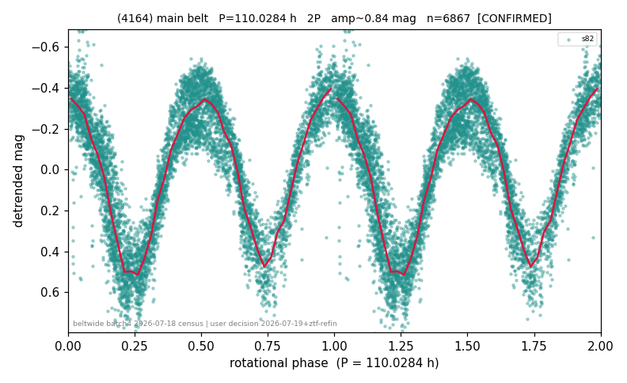

# (4164)

**Adopted:** 109.468 h, 2P, CANDIDATE

<!-- AUTO:START (regenerated from pipeline outputs; do not hand-edit this block) -->
## Evidence (auto)

Detected in 1 sector(s):

| sector | N | baseline (h) | P_phot (h) | power | FAP | cycles | flags |
|--|--|--|--|--|--|--|--|
| s82 | 6892 | 568.7 | 54.7336 | 0.8193 | 0.0e+00 | 10.4 | star-cleaned:26,2P-ambiguous |

- Pipeline refine said: **2P** (folded amp_fourier 0.868); flags: near-comb(amp-cleared):n=3,6;sick-dips-excised:s82(25)
- DIA (de-comb): survived(dPW=+1%,R2=0.02,s82@54.734h,3sec)
- Gates: FAP<1e-3 and power>=0.10 per detecting sector; single strong sector (candidate ceiling).
- Adopted shape: **2P** (folded-amplitude rule; pipeline agrees).

### Why this row reads the way it does

- USER DECISION 2026-07-19 (rule refined): CANDIDATE 2P/109.468h, doubling->100h UNCONFIRMED. P_phot=54.734h is emphatically real: pw 0.82 FAP~0, 10.4 cycles, split-half r=+0.99, and decomb-CLEAN despite sitting 0.12% from the n=6 comb tooth (drop +1%, R2=0.02). Folded amp 0.82 (decomb-stable) -> 2P mandatory -> 109.47h. Single sector: the doubled period cannot be independently confirmed -> CANDIDATE (not KILL: the DETECTION is secure, only the doubling tier is pending). Needs 2nd TESS sector or ZTF. Refined DOA rule: KILL is for >100h photometric detections (trend-like), not amplitude-doublings of well-sampled fundamentals.

<!-- AUTO:END -->
