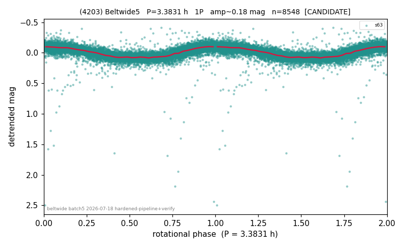

# (4203)

**Adopted:** 3.3831 h, 1P, CANDIDATE

<!-- AUTO:START (regenerated from pipeline outputs; do not hand-edit this block) -->
## Evidence (auto)

Detected in 1 sector(s):

| sector | N | baseline (h) | P_phot (h) | power | FAP | cycles | flags |
|--|--|--|--|--|--|--|--|
| s63 | 8548 | 604.8 | 3.3831 | 0.4872 | 0.0e+00 | 178.8 | star-cleaned:28,2P-ambiguous |

- Pipeline refine said: **1P** (folded amp_fourier 0.223); flags: sick-dips-excised:s63(9)
- DIA (de-comb): survived(dPW=-2%,R2=0.01,s63@3.383h,2sec)
- Gates: FAP<1e-3 and power>=0.10 per detecting sector; single strong sector (candidate ceiling).
- Adopted shape: **1P** (folded-amplitude rule; pipeline agrees).

### Why this row reads the way it does

- s63 LS P=3.3831h pw=0.487 FAP=0, 178 cycles, reproduced exactly. Folded amp=0.179 (<0.40) upholds 1P; 2P test fails (dmag=0.005<<0.05 despite disp_rat

<!-- AUTO:END -->
