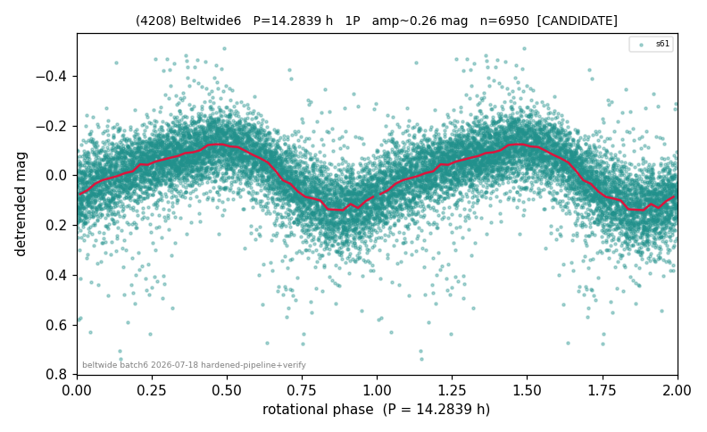

# (4208)

**Adopted:** 14.2839 h, 1P, CANDIDATE

<!-- AUTO:START (regenerated from pipeline outputs; do not hand-edit this block) -->
## Evidence (auto)

Detected in 1 sector(s):

| sector | N | baseline (h) | P_phot (h) | power | FAP | cycles | flags |
|--|--|--|--|--|--|--|--|
| s61 | 6974 | 502.8 | 14.2839 | 0.4891 | 0.0e+00 | 35.2 | star-cleaned:47,2P-ambiguous |

- Pipeline refine said: **1P** (folded amp_fourier 0.245); flags: sick-dips-excised:s61(24)
- DIA (de-comb): survived(dPW=-0%,R2=0.02,s61@14.284h,2sec)
- Gates: FAP<1e-3 and power>=0.10 per detecting sector; single strong sector (candidate ceiling).
- Adopted shape: **1P** (folded-amplitude rule; pipeline agrees).

### Why this row reads the way it does

- folded_amp=0.279. Only lc_4208_s61.csv exists (single sector, n=6974, baseline 502.8h), so CONFIRMED is unreachable per house rules regardless of signal quality; independent LS scan reproduces P=14.2839h exactly (power=0.489, Ba

<!-- AUTO:END -->
