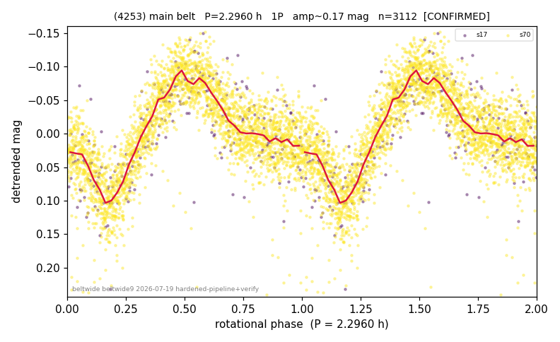

# (4253)

**Adopted:** 2.296 h, 1P, CONFIRMED

<!-- AUTO:START (regenerated from pipeline outputs; do not hand-edit this block) -->
## Evidence (auto)

Detected in 2 sector(s):

| sector | N | baseline (h) | P_phot (h) | power | FAP | cycles | flags |
|--|--|--|--|--|--|--|--|
| s17 | 258 | 176.5 | 2.296 | 0.4798 | 4.6e-33 | 76.9 | clean |
| s70 | 2854 | 175.6 | 2.2952 | 0.5461 | 0.0e+00 | 76.5 | 2P-ambiguous |

- Refined shape: **1P** (folded amp_fourier 0.147); flags: clean
- DIA (de-comb): not triggered (clean, fast, non-comb)
- Gates: FAP<1e-3 and power>=0.10 per detecting sector; >=2 sectors agree (harmonic-aware); folded-amplitude rule -> 1P.

<!-- AUTO:END -->
