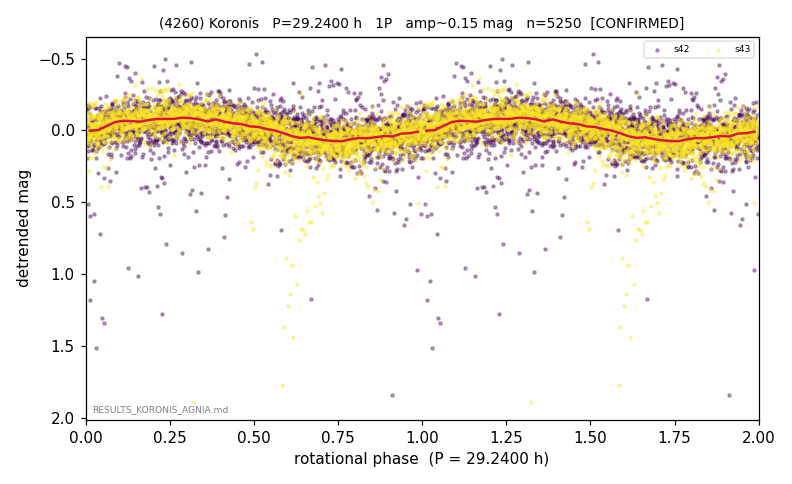

# (4260)

**Adopted:** 29.24 h, 1P, CONFIRMED

<!-- AUTO:START (regenerated from pipeline outputs; do not hand-edit this block) -->
## Evidence (auto)

Detected in 2 sector(s):

| sector | N | baseline (h) | P_phot (h) | power | FAP | cycles | flags |
|--|--|--|--|--|--|--|--|
| s42 | 2529 | 558.9 | 29.3638 | 0.1512 | 1.2e-85 | 19.0 | star-cleaned:35,2P-ambiguous |
| s43 | 2721 | 569.9 | 29.3146 | 0.4326 | 0.0e+00 | 19.4 | 2P-ambiguous |

- Pipeline refine said: **1P** (folded amp_fourier 0.2); flags: dump-alias-suspect:n=11;sick-dips-excised:s42(16),s43(5);harmonic-only-agreement:s42(pw=0.
- DIA (de-comb): inconclusive(dPW=+38%,R2=0.61,s43@29.339h)
- Coverage: **2 sector(s)**, best sector covers **19.49 cycles** of the adopted period. Measured periodogram peak width 4% of the period, i.e. about **+/- 0.47 h** (1 sigma); the decimal places in the adopted value are not a precision claim.
- Factor of two: no doubling was applied.
- Gates: FAP<1e-3 and power>=0.10 per detecting sector; >=2 sectors agree (harmonic-aware).
- Adopted shape: **1P** (folded-amplitude rule; pipeline agrees).

<!-- AUTO:END -->
