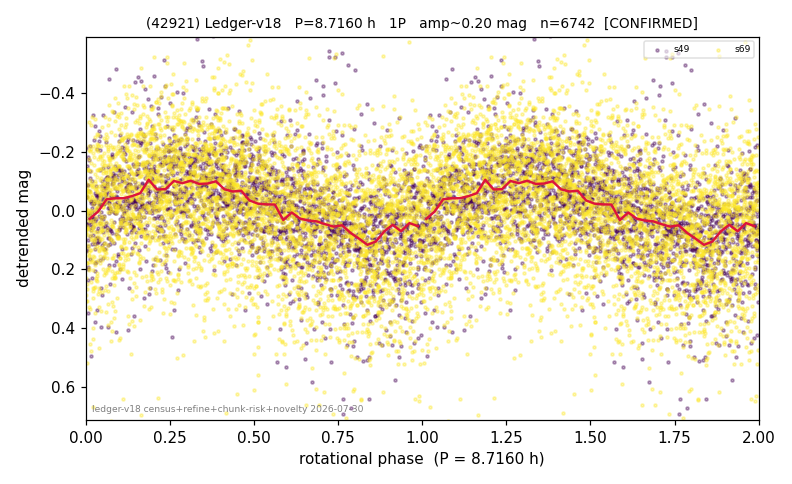

# (42921)

**Adopted:** 8.716 h, 1P, CONFIRMED

<!-- AUTO:START (regenerated from pipeline outputs; do not hand-edit this block) -->
## Evidence (auto)

Detected in 2 sector(s):

| sector | N | baseline (h) | P_phot (h) | power | FAP | cycles | flags |
|--|--|--|--|--|--|--|--|
| s49 | 2324 | 601.5 | 8.7219 | 0.192 | 3.7e-103 | 69.0 | star-cleaned:38,2P-ambiguous |
| s69 | 4474 | 336.1 | 8.7104 | 0.1128 | 1.1e-111 | 38.6 | star-cleaned:132,2P-ambiguous |

- Pipeline refine said: **1P** (folded amp_fourier 0.225); flags: sick-dips-excised:s49(4),s69(12)
- DIA (de-comb): not triggered (clean, fast, non-comb)
- Gates: FAP<1e-3 and power>=0.10 per detecting sector; >=2 sectors agree (harmonic-aware).
- Adopted shape: **1P** (folded-amplitude rule; pipeline agrees).

### Why this row reads the way it does

- 2 sector(s) detecting
- cross-sector fold correlation 0.89
- single-peaked at folded amp 0.225 mag

<!-- AUTO:END -->
