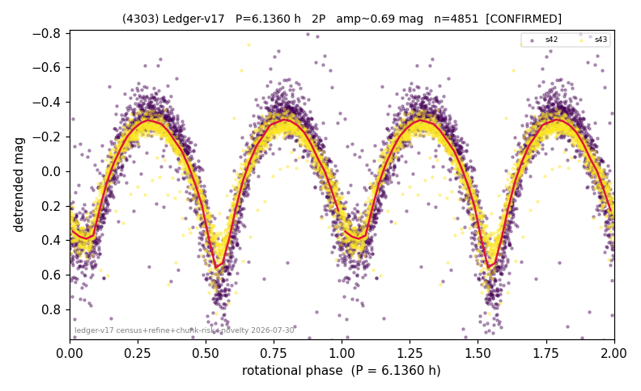

# (4303)

**Adopted:** 6.136 h, 2P, CONFIRMED

<!-- AUTO:START (regenerated from pipeline outputs; do not hand-edit this block) -->
## Evidence (auto)

Detected in 2 sector(s):

| sector | N | baseline (h) | P_phot (h) | power | FAP | cycles | flags |
|--|--|--|--|--|--|--|--|
| s42 | 2608 | 601.0 | 3.0674 | 0.7733 | 0.0e+00 | 195.9 | star-cleaned:34,2P-ambiguous |
| s43 | 2260 | 585.8 | 3.0688 | 0.8554 | 0.0e+00 | 190.9 | star-cleaned:1,2P-ambiguous |

- Pipeline refine said: **2P** (folded amp_fourier 0.86); flags: sick-dips-excised:s42(10),s43(1)
- DIA (de-comb): survived(dPW=+5%,R2=0.51,s43@3.068h,4sec)
- Coverage: **2 sector(s)**, best sector covers **97.95 cycles** of the adopted period. Measured periodogram peak width 0% of the period, i.e. about **+/- 0.01 h** (1 sigma); the decimal places in the adopted value are not a precision claim.
- Factor of two: **adopted on the amplitude convention**: standard practice for an elongated body, but a convention rather than a measurement.
- Gates: FAP<1e-3 and power>=0.10 per detecting sector; >=2 sectors agree (harmonic-aware).
- Adopted shape: **2P** (folded-amplitude rule; pipeline agrees).

### Why this row reads the way it does

- 2 sector(s) detecting
- cross-sector fold correlation 0.99
- doubling BY CONVENTION: amplitude rule on folded amp 0.860 mag, not individually audited

<!-- AUTO:END -->
