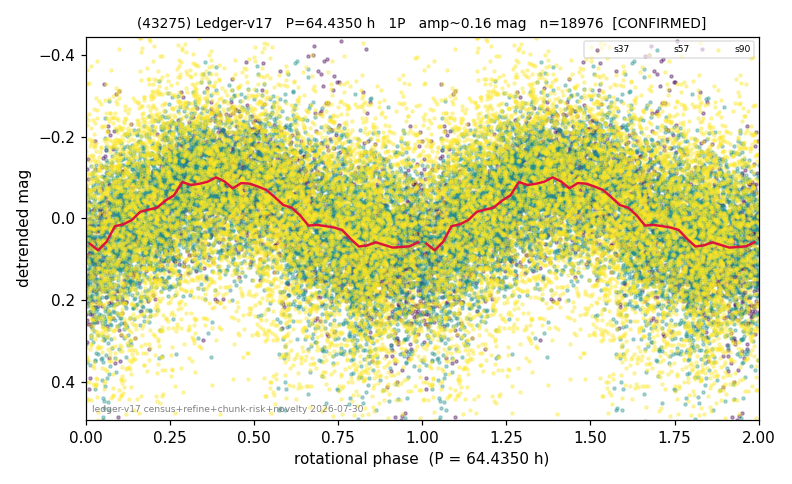

# (43275)

**Adopted:** 64.435 h, 1P, CONFIRMED

<!-- AUTO:START (regenerated from pipeline outputs; do not hand-edit this block) -->
## Evidence (auto)

Detected in 3 sector(s):

| sector | N | baseline (h) | P_phot (h) | power | FAP | cycles | flags |
|--|--|--|--|--|--|--|--|
| s37 | 2664 | 591.2 | 64.1949 | 0.3179 | 1.4e-216 | 9.2 | star-cleaned:17,2P-ambiguous |
| s57 | 8527 | 672.9 | 64.6758 | 0.2302 | 0.0e+00 | 10.4 | star-cleaned:1,2P-ambiguous |
| s90 | 7954 | 558.6 | 64.9126 | 0.0962 | 1.0e-169 | 8.6 | star-cleaned:31 |

- Pipeline refine said: **1P** (folded amp_fourier 0.225); flags: dump-alias-suspect:n=5;gap-alias-risk:77h;sick-dips-excised:s37(7),s57(7)
- DIA (de-comb): **NOT RUN for this lot.** No de-comb verdict exists for this object, so momentum-dump contamination has not been excluded by that test here.
- Gates: FAP<1e-3 and power>=0.10 per detecting sector; >=2 sectors agree (harmonic-aware).
- Adopted shape: **1P** (folded-amplitude rule; pipeline agrees).

### Why this row reads the way it does

- 2 sector(s) detecting
- cross-sector fold correlation 0.88
- single-peaked at folded amp 0.225 mag
- pipeline flag: dump-alias-suspect

<!-- AUTO:END -->
