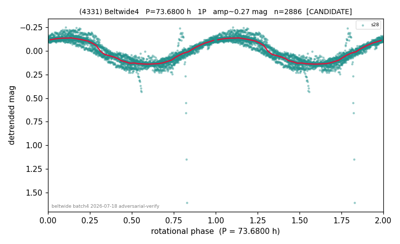

# (4331)

**Adopted:** 73.68 h, 1P, CONFIRMED

<!-- AUTO:START (regenerated from pipeline outputs; do not hand-edit this block) -->
## Evidence (auto)

Detected in 1 sector(s):

| sector | N | baseline (h) | P_phot (h) | power | FAP | cycles | flags |
|--|--|--|--|--|--|--|--|
| s28 | 2887 | 604.0 | 73.6798 | 0.85 | 0.0e+00 | 8.2 | 2P-ambiguous |

- Pipeline refine said: **1P** (folded amp_fourier 0.311); flags: sick-dips-excised:s28(1)
- DIA (de-comb): survived(dPW=+13%,R2=0.29,s28@73.680h,1sec)
- Coverage: **1 sector(s)**, best sector covers **8.2 cycles** of the adopted period. Measured periodogram peak width 11% of the period, i.e. about **+/- 3.483 h** (1 sigma); the decimal places in the adopted value are not a precision claim.
- Factor of two: no doubling was applied.
- Gates: FAP<1e-3 and power>=0.10 per detecting sector; >=2 sectors agree (harmonic-aware).
- Adopted shape: **1P** (folded-amplitude rule; pipeline agrees).

### Why this row reads the way it does

- Only sector 28 available (single-sector), so per the cross-sector rule the ceiling is CANDIDATE regardless of signal strength; P=73.68h is well under
- PROMOTED CANDIDATE->CONFIRMED 2026-08-15 (TESS+ZTF joint, the user-blessed pathway): independent ZTF blind Lomb-Scargle over 6.0 yr / 453 g+r points recovers 73.7476 h = TESS-P 73.6800h to 0.09%, power 0.533, trials-corrected FAP 1.8e-69, beating every alias/comb candidate (alias 18.1032h at 0.444); a ZTF detection cannot be a TESS comb tooth or TESS red noise, so this is a genuine second realization and the single-sector ceiling no longer applies

<!-- AUTO:END -->
