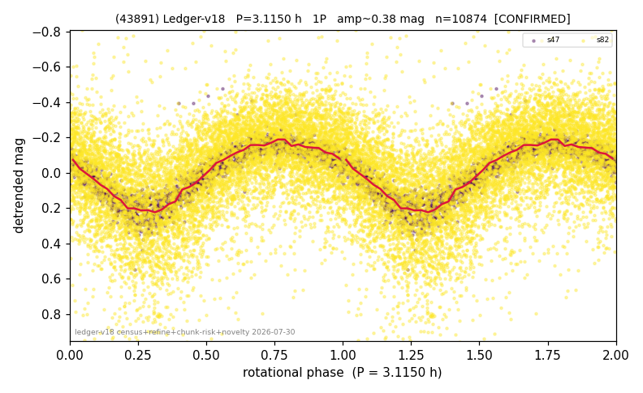

# (43891)

**Adopted:** 3.115 h, 1P, CONFIRMED

<!-- AUTO:START (regenerated from pipeline outputs; do not hand-edit this block) -->
## Evidence (auto)

Detected in 2 sector(s):

| sector | N | baseline (h) | P_phot (h) | power | FAP | cycles | flags |
|--|--|--|--|--|--|--|--|
| s47 | 2271 | 531.0 | 3.1148 | 0.8641 | 0.0e+00 | 170.5 | 2P-ambiguous |
| s82 | 8627 | 595.7 | 3.1152 | 0.2775 | 0.0e+00 | 191.2 | star-cleaned:83,2P-ambiguous |

- Pipeline refine said: **1P** (folded amp_fourier 0.392); flags: amp-from-clean-sectors(ignored s82);sick-dips-excised:s82(11);near-threshold:0.39
- DIA (de-comb): survived(dPW=+1%,R2=0.20,s47@3.115h,4sec)
- Gates: FAP<1e-3 and power>=0.10 per detecting sector; >=2 sectors agree (harmonic-aware).
- Adopted shape: **1P** (folded-amplitude rule; pipeline agrees).

### Why this row reads the way it does

- 2 sector(s) detecting
- cross-sector fold correlation 0.99
- single-peaked at folded amp 0.392 mag

<!-- AUTO:END -->
