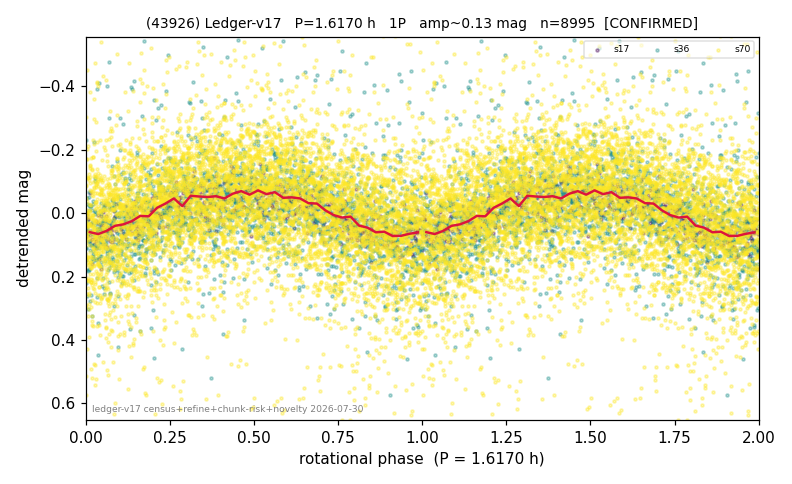

# (43926)

**Adopted:** 3.234 h, 2P, CONFIRMED

<!-- AUTO:START (regenerated from pipeline outputs; do not hand-edit this block) -->
## Evidence (auto)

Detected in 3 sector(s):

| sector | N | baseline (h) | P_phot (h) | power | FAP | cycles | flags |
|--|--|--|--|--|--|--|--|
| s17 | 607 | 550.0 | 1.6162 | 0.5004 | 3.0e-87 | 340.3 | 2P-ambiguous |
| s36 | 2022 | 526.3 | 1.6178 | 0.0935 | 4.9e-39 | 325.4 | star-cleaned:5 |
| s70 | 6434 | 450.6 | 1.6175 | 0.1115 | 3.0e-160 | 278.6 | star-cleaned:147,2P-ambiguous |

- Pipeline refine said: **1P** (folded amp_fourier 0.146); flags: amp-from-clean-sectors(ignored s70);sick-dips-excised:s70(51);harmonic-only-agreement:s70(
- DIA (de-comb): survived_v2(ret=1.000[1.00-1.00],s17@1.617h)
- Coverage: **3 sector(s)**, best sector covers **170.07 cycles** of the adopted period. Measured periodogram peak width 0% of the period, i.e. about **+/- 0.001803 h** (1 sigma); the decimal places in the adopted value are not a precision claim.
- Factor of two: **measured on the data** (odd-harmonic power or unequal minima, significant and reproduced), METHODOLOGY 3b.
- Gates: FAP<1e-3 and power>=0.10 per detecting sector; >=2 sectors agree (harmonic-aware).
- **Adopted shape 2P OVERRIDES the pipeline's 1P** (doubling audit 2026-07-25: folded amplitude >= 0.25 mag, so a single-peaked curve is physically implausible; Harris convention -> 2P. The census 3-test doubling logic was measured at only 30% recall against 289 LCDB U>=2 ground-truth periods).

### Why this row reads the way it does

- 2 sector(s) detecting
- cross-sector fold correlation 0.95
- single-peaked at folded amp 0.146 mag
- pipeline flag: harmonic-only-agreement
- CORRECTED 1.617->3.2340 h (2026-08-01 sub-barrier sweep): all 49 catalog periods below 2.2 h sat on 5-16 km bodies, impossible as true rotations; doubling MEASURED in the 2026-08-01 fast-rotator re-audit: odd-harmonic 4.10 sigma (3/3 sectors), minima z=-1.35

<!-- AUTO:END -->
