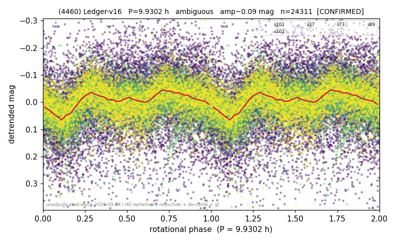

# (4460)

**Adopted:** 9.9302 h, ambiguous, CONFIRMED

<!-- AUTO:START (regenerated from pipeline outputs; do not hand-edit this block) -->
## Evidence (auto)

Detected in 5 sector(s):

| sector | N | baseline (h) | P_phot (h) | power | FAP | cycles | flags |
|--|--|--|--|--|--|--|--|
| s37 | 1300 | 325.2 | 9.9046 | 0.1756 | 1.4e-50 | 32.8 | clean |
| s73 | 6446 | 541.3 | 4.9607 | 0.0785 | 1.2e-109 | 109.1 | star-cleaned:113 |
| s89 | 4624 | 337.9 | 4.9583 | 0.0772 | 3.3e-76 | 68.2 | star-cleaned:93 |
| s101 | 6935 | 532.5 | 9.9152 | 0.0452 | 5.6e-65 | 53.7 | star-cleaned:19 |
| s102 | 5137 | 418.3 | 9.9305 | 0.1246 | 1.2e-143 | 42.1 | star-cleaned:145,2P-ambiguous |

- Pipeline refine said: **1P** (folded amp_fourier 0.077); flags: clean
- DIA (de-comb): survived (verdict from a dedicated pass recorded in catalog/evidence.csv, not in this lot's refine output)
- Coverage: **2 sector(s)**, best sector covers **53.63 cycles** of the adopted period. Measured periodogram peak width 2% of the period, i.e. about **+/- 0.08193 h** (1 sigma); the decimal places in the adopted value are not a precision claim.
- Factor of two: **undecided**. The fold at the photometric period does not settle whether it or twice it is the rotation period, and the calibrated test of METHODOLOGY 3b-bis is silent. The photometric period is the published one and twice it is equally allowed.
- Gates: FAP<1e-3 and power>=0.10 per detecting sector; >=2 sectors agree (harmonic-aware).
- **Adopted shape ambiguous OVERRIDES the pipeline's 1P.** The catalog shape is a deliberate call, not the census default; what supports it for this object is the factor-of-two line above and the note at the end of this block (METHODOLOGY 3b). The census 3-test doubling logic was measured at only 30% recall against 289 LCDB U>=2 ground-truth periods, which is why it is overridden rather than followed.

### Why this row reads the way it does

- doubling: ambiguous, P1 = 9.9302 h is published and 2 x P1 = 19.8604 h remains equally possible; the fold at P1 shows 3 prominent maxima with an unstable count (30 per cent of block bootstraps), the folded amplitude 0.157 mag is below the 0.40 cut and the calibrated test is silent (p_emp 0.933 and 0.941 on 20,000 null realisations)
- two consecutive detecting sectors, s101 and s102, give 9.9152 and 9.9305 h, the only multi-sector object of the 2026-09 batch besides (3136)
- verified outside the standard census pipeline (HG ephemeris reduction, single global cubic trend, trend-degree and time-half stability, de-comb): docs/results/nuovi_periodi_20260908.md and docs/results/doubling_calibrated.md

<!-- AUTO:END -->

## Why this object arrives only now
Its light curve came out of the ledger lot v16, extracted for the slow-rotator rate study
rather than for the catalog. The catalog was frozen on 2026-08-24 for the method and
catalog paper, before those lots had been adjudicated object by object, so a stock of
measured but unarbitrated periods sat outside it. This object is one of fourteen taken
out of that stock on 2026-09-08, verified, and admitted here.

## Why the per-sector table above does not show the adopted period
The AUTO block reports the **census** pass, which detrends each sector with its own
polynomial and searches sector by sector. This object was re-derived from scratch in the
2026-09-08 adjudication with a different and physically stronger reduction, so the two
sets of numbers are not meant to agree digit by digit; the adopted value is the
re-derived one. The full procedure and its per-object output are in
`docs/results/nuovi_periodi_20260908.md` and `docs/results/nuovi_periodi_20260908.csv`
in the working repository, and the doubling adjudication in
`docs/results/doubling_calibrated.md`.

## How it was verified

Not by the standard census gates alone. Each of the fourteen went through the same
battery, listed here with this object's numbers.

1. **Physical reduction.** JPL Horizons ephemerides from the TESS viewpoint (centre
   500@-95), then reduced magnitude with the HG phase function at G = 0.15, which
   removes distance and phase angle physically instead of absorbing them into a
   per-sector polynomial. Outliers rejected at 5 sigma from the robust median
   (118 points).
2. **One global trend, not one per sector.** A single cubic plus two harmonics over
   the whole 975 h baseline, with the period search capped at
   baseline/8, that is at least eight rotations inside the data.
   Photometric period P1 = 9.9302 h, chi-squared gain 6.0 per cent.
3. **Stability against the trend degree.** The same search at polynomial degree 2, 3
   and 4 returns the same period (spread 0.0 per cent).
4. **Independent subsets.** The two time halves return 9.913 and 9.93 h,
   which is the adopted photometric period, its double, or its half, within 5 per
   cent.
5. **De-comb.** TESS orbits in 328.8 h, so any periodogram has excess power at the
   teeth 328.8/n. Verdict for this object: **survived** (power change -15%, model
   R2 = 0.14).
   The photometric period falls at n >= 13, where adjacent teeth are closer
   together than any period can be separated from them, so tooth proximity carries
   no information here.

## What the coverage really is
**Two consecutive detecting sectors, s101 and s102**, giving photometric periods
9.9152 and 9.9305 h, and a joint contiguous baseline of 974.8 h, that is 98.2 cycles
of the adopted period. The `n_cycles_best` column above reports 53.63, the cycles of
the best single sector, which is the column's definition; both numbers are stated.
The census also detects this object in s37 at 9.9046 h and in s73 and s89 at 4.96 h,
which is the second harmonic of the same period; those sectors were not part of the
adjudicated set and are not counted in `n_sectors`.

## The factor of two

Decided with the **calibrated** test of METHODOLOGY 3b-bis, not with the nominal
odd-harmonic F test. That test was validated on 174 external LCDB labels in the same
pass and found **not calibrated**: it declares a doubling for 44 of the 62 objects
whose published period equals our photometric period, specificity 0.290. Its nominal
p-values are not quoted anywhere in this entry. The calibrated replacement draws its
significance from a block bootstrap under the single-peaked hypothesis, 20,000
realisations at two block lengths.

| quantity at P1 = 9.9302 h | value |
|--|--|
| calibrated p, 1 d blocks | 0.93280 |
| calibrated p, 2 d blocks | 0.94055 |
| unequal minima, z above the null mean | -1.77 |
| prominent maxima in the fold (stability) | 3 (30 per cent) |
| folded amplitude at P1 | 0.157 mag |

**Ambiguous, and published as such.** The photometric period 9.9302 h is the
published value and **2 x P1 = 19.8604 h remains exactly as possible**: nothing
in the data prefers one over the other. The calibrated test is silent, the minima
do not differ significantly, and the fold topology does not settle it either
(3 prominent maxima, but the count is unstable, holding in only
30 per cent of the bootstraps).

## Novelty
Checked on **both** gates together on 2026-09-08, the LCDB 2023 summary **and** the
SsODNet `ssoCard` spins field: neither carries a rotation period for this object
(`docs/results/gap_hunt_20260905.md`, `novel_both_gates_20260908.csv` in the working
repository). One gate is not enough in either direction: of 72 objects SsODNet
reported without a spin, 36 already had an LCDB period, and three objects of the same
sweep are absent from the LCDB summary but carry an SsODNet spin. This is a first
determination on both.

## Verdict
CONFIRMED ambiguous / 9.9302 h. The alias 2 x P1 = 19.8604 h is equally possible and neither is preferred.
