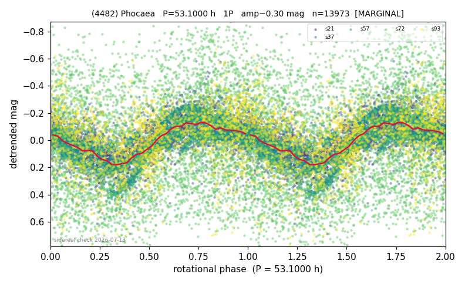

# (4482)

**Adopted:** 53.1 h, 1P, MARGINAL

<!-- AUTO:START (regenerated from pipeline outputs; do not hand-edit this block) -->
## Evidence (auto)

Detected in 5 sector(s):

| sector | N | baseline (h) | P_phot (h) | power | FAP | cycles | flags |
|--|--|--|--|--|--|--|--|
| s21 | 933 | 642.0 | 52.7861 | 0.6857 | 1.5e-229 | 12.2 | 2P-ambiguous |
| s37 | 2033 | 476.5 | 53.0847 | 0.2902 | 9.4e-147 | 9.0 | star-cleaned:2,2P-ambiguous |
| s57 | 4650 | 447.3 | 53.4327 | 0.6629 | 0.0e+00 | 4.2 | clean |
| s72 | 4451 | 488.2 | 51.9967 | 0.0599 | 2.9e-55 | 9.4 | clean |
| s93 | 1941 | 146.7 | 56.9818 | 0.2225 | 9.2e-102 | 2.6 | phase-curve-risk,2P-untestable,2P-ambigu |

- Refined shape: **1P** (folded amp_fourier 0.339); flags: near-comb(amp-cleared):n=6;gap-alias-risk:88h;sick-dips-excised:s93(8);incoherent-sectors:
- DIA (de-comb): survived(dPW=+2%,R2=0.03,s57@53.085h,7sec)
- Gates: FAP<1e-3 and power>=0.10 per detecting sector; single strong sector (candidate ceiling); folded-amplitude rule -> 1P.

<!-- AUTO:END -->
