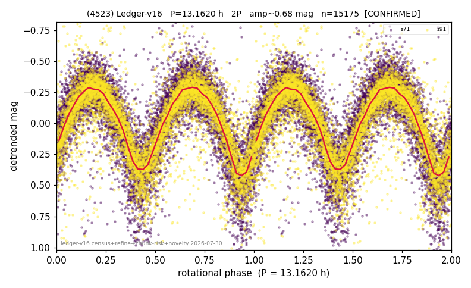

# (4523)

**Adopted:** 13.162 h, 2P, CONFIRMED

<!-- AUTO:START (regenerated from pipeline outputs; do not hand-edit this block) -->
## Evidence (auto)

Detected in 2 sector(s):

| sector | N | baseline (h) | P_phot (h) | power | FAP | cycles | flags |
|--|--|--|--|--|--|--|--|
| s71 | 8178 | 597.0 | 6.5809 | 0.601 | 0.0e+00 | 90.7 | star-cleaned:45,2P-ambiguous |
| s91 | 7133 | 634.3 | 6.5816 | 0.6969 | 0.0e+00 | 96.4 | star-cleaned:38,2P-ambiguous |

- Pipeline refine said: **2P** (folded amp_fourier 0.724); flags: sick-dips-excised:s71(30),s91(88)
- DIA (de-comb): not triggered (clean, fast, non-comb)
- Gates: FAP<1e-3 and power>=0.10 per detecting sector; >=2 sectors agree (harmonic-aware).
- Adopted shape: **2P** (folded-amplitude rule; pipeline agrees).

### Why this row reads the way it does

- 2 sector(s) detecting
- cross-sector fold correlation 0.99
- doubling BY CONVENTION: amplitude rule on folded amp 0.724 mag, not individually audited

<!-- AUTO:END -->
