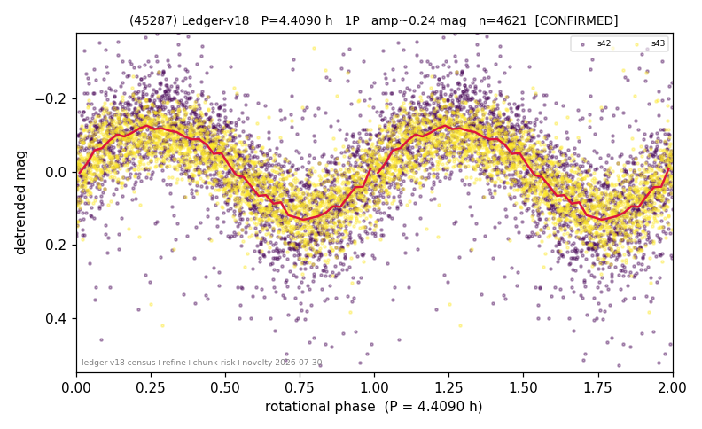

# (45287)

**Adopted:** 4.409 h, 1P, CONFIRMED

<!-- AUTO:START (regenerated from pipeline outputs; do not hand-edit this block) -->
## Evidence (auto)

Detected in 2 sector(s):

| sector | N | baseline (h) | P_phot (h) | power | FAP | cycles | flags |
|--|--|--|--|--|--|--|--|
| s42 | 2401 | 599.2 | 4.409 | 0.4585 | 8.5e-315 | 135.9 | star-cleaned:15,2P-ambiguous |
| s43 | 2237 | 589.5 | 4.4082 | 0.5965 | 0.0e+00 | 133.7 | 2P-ambiguous |

- Pipeline refine said: **1P** (folded amp_fourier 0.292); flags: sick-dips-excised:s42(6),s43(2)
- DIA (de-comb): survived_v2(ret=1.003[1.00-1.01],s43@4.409h)
- Coverage: **2 sector(s)**, best sector covers **135.91 cycles** of the adopted period. Measured periodogram peak width 1% of the period, i.e. about **+/- 0.0118 h** (1 sigma); the decimal places in the adopted value are not a precision claim.
- Factor of two: no doubling was applied.
- Gates: FAP<1e-3 and power>=0.10 per detecting sector; >=2 sectors agree (harmonic-aware).
- Adopted shape: **1P** (folded-amplitude rule; pipeline agrees).

### Why this row reads the way it does

- 2 sector(s) detecting
- cross-sector fold correlation 0.97
- single-peaked at folded amp 0.292 mag

<!-- AUTO:END -->
