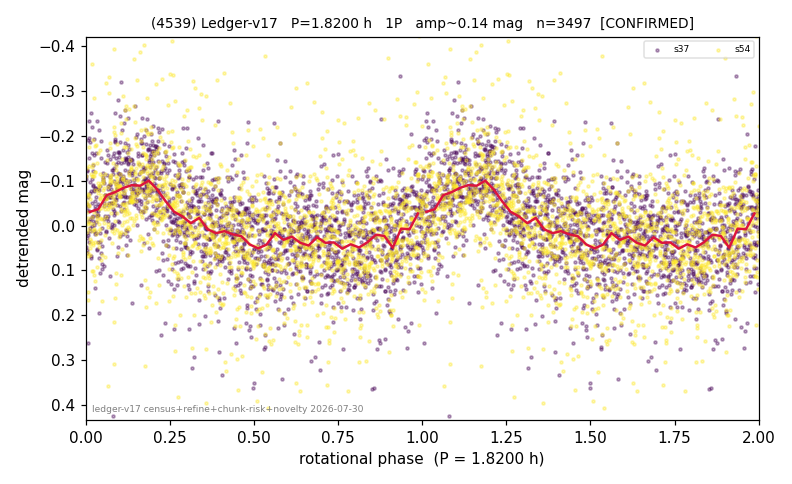

# (4539)

**Adopted:** 1.82 h, 1P, CONFIRMED

<!-- AUTO:START (regenerated from pipeline outputs; do not hand-edit this block) -->
## Evidence (auto)

Detected in 2 sector(s):

| sector | N | baseline (h) | P_phot (h) | power | FAP | cycles | flags |
|--|--|--|--|--|--|--|--|
| s37 | 1740 | 381.0 | 1.8197 | 0.2156 | 1.8e-87 | 209.4 | star-cleaned:1,2P-ambiguous |
| s54 | 1767 | 619.2 | 1.8209 | 0.118 | 3.6e-44 | 340.0 | star-cleaned:10,2P-ambiguous |

- Pipeline refine said: **1P** (folded amp_fourier 0.156); flags: sick-dips-excised:s54(9)
- DIA (de-comb): not triggered (clean, fast, non-comb)
- Gates: FAP<1e-3 and power>=0.10 per detecting sector; >=2 sectors agree (harmonic-aware).
- Adopted shape: **1P** (folded-amplitude rule; pipeline agrees).

### Why this row reads the way it does

- 2 sector(s) detecting
- cross-sector fold correlation 0.87
- single-peaked at folded amp 0.156 mag

<!-- AUTO:END -->
